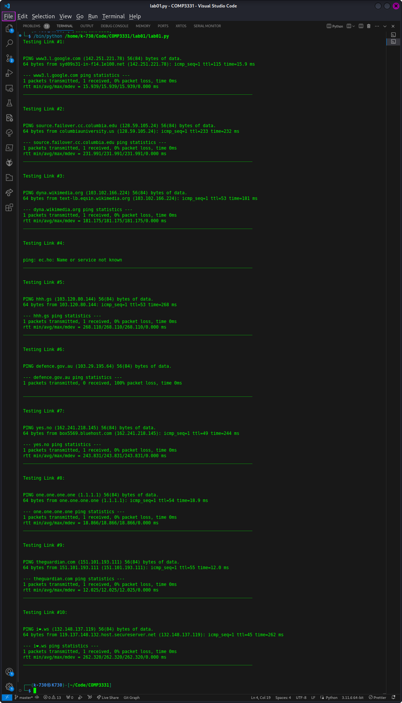
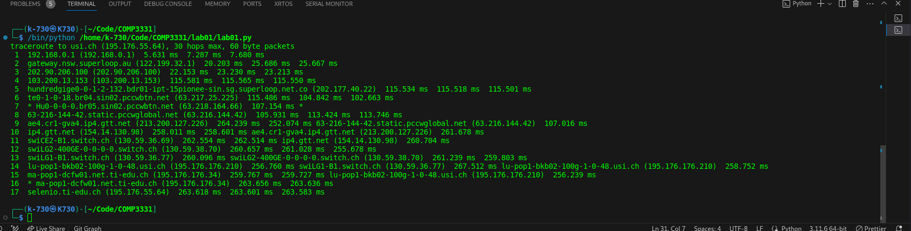
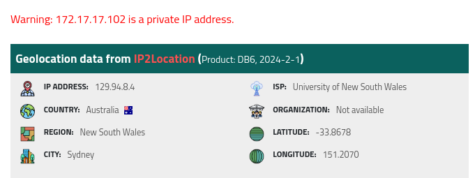
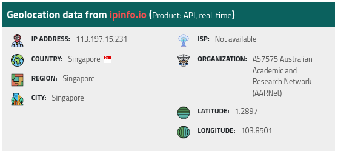
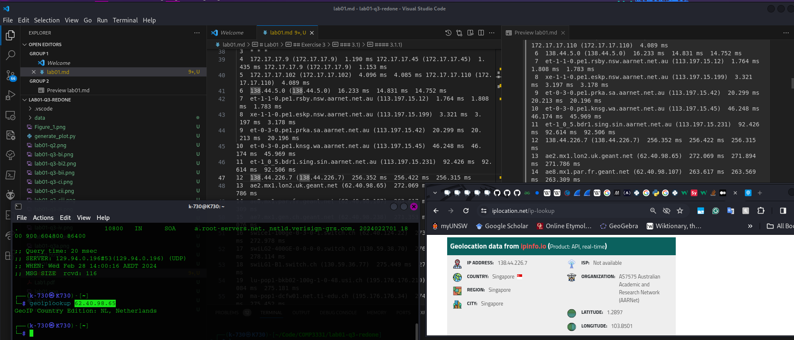
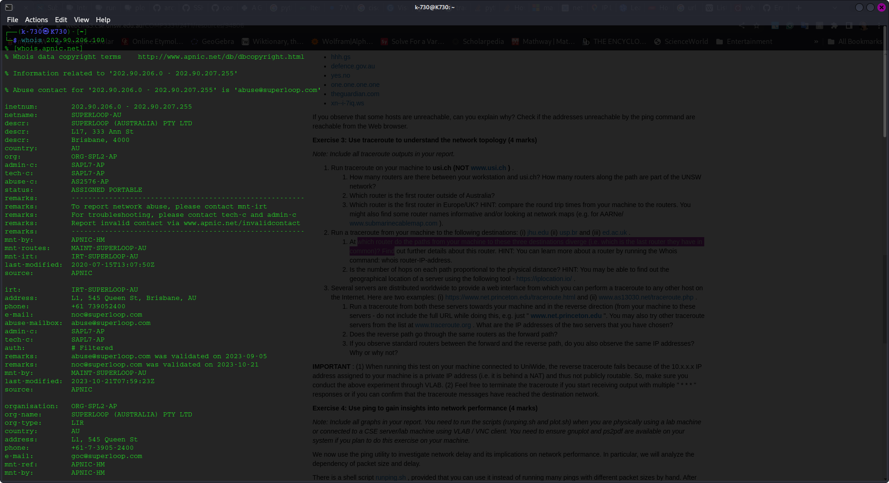
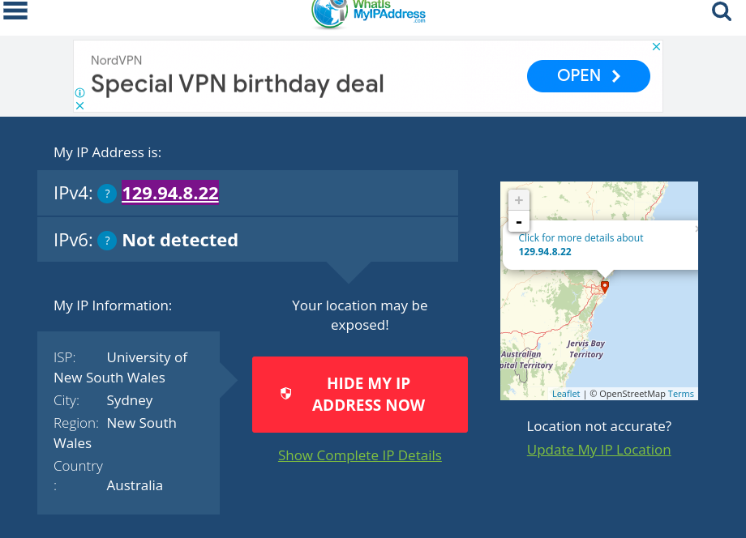
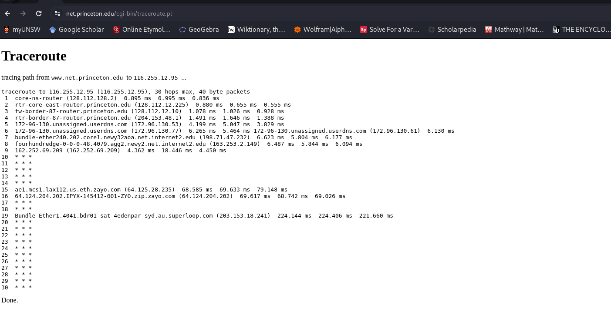
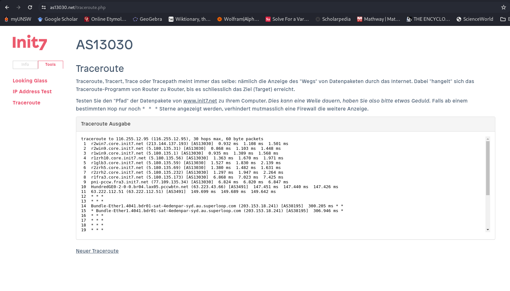
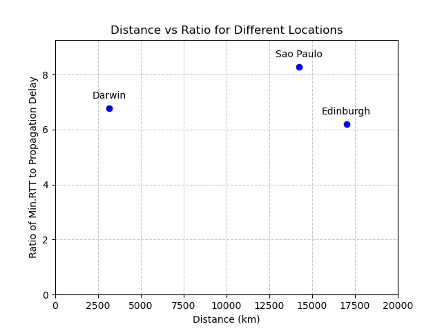

# Lab01

Disclaimer: THIS WAS EXERCISE WAS COMPLETED WITH MY HOME INTERNET.

## Exercise 2

**Output for q2**


| URL                                           | Reachable by ping        | Reachable by Web |
| --------------------------------------------- | ------------------------ | ---------------- |
| [www.google.co.uk](http://www.google.co.uk)   | Is reachable       | Yes              |
| [www.columbia.edu](http://www.columbia.edu)   | is reachable             | Yes              |
| [www.wikipedia.org](http://www.wikipedia.org) | is reachable             | Yes              |
| ec.ho                                         | is NOT reachable.  DNS non-e      | NO               |
| [hhh.gs](http://hhh.gs)                       | is reachable.            | Yes              |
| [defence.gov.au](http://defence.gov.au)       | NOT reachable by ping. Firewall blocks ICMP packet| Yes              |
| [yes.no](http://yes.no)                       | is reachable             | Yes              |
| one.one.one.one                               | is reachable             | Yes              |
| [theguardian.com](http://theguardian.com)     | is reachable             | Yes              |
| [xn--i-7iq.ws](http://xn--i-7iq.ws)           | is reachable             | Yes              |

## Exercise 3

### 3.1)



#### 3.1.1)

There are 17 routers along the path to the [usi.ch](usi.ch) from my home internet.

For UNSW, last UNSW router is router #5 (172.17.17.102). However, hop #3 may be concealed or blocked by a firewall. And hop #4 may be a virtual router on the same physical router. Therefore, the number of **PHYSICAL UNSW ROUTERS** is 3.

```
 1  cserouter1-trusted.orchestra.cse.unsw.EDU.AU (129.94.208.251)  0.258 ms  0.156 ms  0.134 ms
 2  129.94.39.17 (129.94.39.17)  0.982 ms  1.020 ms  0.956 ms
 3  * * *
 4  172.17.17.9 (172.17.17.9)  1.190 ms 172.17.17.45 (172.17.17.45)  1.435 ms 172.17.17.9 (172.17.17.9)  1.153 ms
 5  172.17.17.102 (172.17.17.102)  4.096 ms  4.085 ms 172.17.17.110 (172.17.17.110)  4.089 ms
 6  138.44.5.0 (138.44.5.0)  16.233 ms  14.831 ms  14.752 ms
 7  et-1-1-0.pe1.rsby.nsw.aarnet.net.au (113.197.15.12)  1.764 ms  1.808 ms  1.783 ms
 8  xe-1-1-0.pe1.eskp.nsw.aarnet.net.au (113.197.15.199)  3.321 ms  3.197 ms  3.178 ms
 9  et-0-3-0.pe1.prka.sa.aarnet.net.au (113.197.15.42)  20.299 ms  20.213 ms  20.196 ms
10  et-0-3-0.pe1.knsg.wa.aarnet.net.au (113.197.15.45)  46.248 ms  46.174 ms  45.969 ms
11  et-1_0_5.bdr1.sing.sin.aarnet.net.au (113.197.15.231)  92.426 ms  92.614 ms  92.506 ms
12  138.44.226.7 (138.44.226.7)  256.352 ms  256.422 ms  256.315 ms
13  ae2.mx1.lon2.uk.geant.net (62.40.98.65)  272.069 ms  271.894 ms  271.786 ms
14  ae8.mx1.par.fr.geant.net (62.40.98.107)  263.617 ms  263.569 ms  263.309 ms
15  ae7.mx1.gen.ch.geant.net (62.40.98.238)  271.353 ms  271.193 ms  271.076 ms
16  swice1-100ge-0-3-0-1.switch.ch (62.40.124.22)  273.588 ms  274.746 ms  272.978 ms
17  swiLG2-400GE-0-0-0-0.switch.ch (130.59.38.70)  276.485 ms  276.605 ms  278.114 ms
18  swiLG1-B1.switch.ch (130.59.36.77)  275.449 ms  274.842 ms  274.952 ms
19  lu-pop1-bkb02-100g-1-0-48.usi.ch (195.176.176.210)  274.932 ms  275.084 ms  275.181 ms
20  ma-pop1-dcfw01.net.ti-edu.ch (195.176.176.34)  274.961 ms  274.938 ms  275.452 ms
21  selenio.ti-edu.ch (195.176.55.64)  276.089 ms  275.713 ms  276.151 ms
```



```
% Information related to '138.44.5.0/24AS7575'

route:          138.44.5.0/24
origin:         AS7575
descr:          Australian Academic and Research Network
                Building 9
                Banks Street
mnt-by:         MAINT-AARNET-AP
last-modified:  2019-04-03T03:55:51Z
source:         APNIC
```

#### 3.1.2)

The first international router outside of Australia is Singapore as seen from the website IP geolocater [ipinfo.co](ipregistery.co)



#### 3.1.3)

The first EU router is number 13. Which is ae2.mx1.lon2.uk.geant.net (62.40.98.65) and is located in the Netherlands. Router #12 is located in Singapore and is not an EU router


### 3.2)

#### 3.2.1)

The last routers that the paths have in common is router #3 with IP address: 202.90.206.100

```
Testing Link #1: 


traceroute to jhu.edu (128.220.192.230), 30 hops max, 60 byte packets
 1  * * *
 2  irb-52686.kecd1-176q4-cbl-e1.gw.unsw.edu.au (172.17.30.178)  17.206 ms  17.416 ms  18.329 ms
 3  ae4-2702.cfw1.gw.unsw.edu.au (172.17.31.52)  1.921 ms  2.217 ms  2.452 ms
 4  irb-52710.kecd1-176q4-cbl-e1.gw.unsw.edu.au (172.17.31.114)  18.061 ms  17.969 ms  17.863 ms
 5  ae2-1907.kecd2-lg11c1-pbr-c1.gw.unsw.edu.au (172.17.17.45)  3.321 ms ae2-1905.kecd1-1q16c3-pbr-c1.gw.unsw.edu.au (172.17.17.9)  3.243 ms ae2-1907.kecd2-lg11c1-pbr-c1.gw.unsw.edu.au (172.17.17.45)  3.166 ms
 6  172.17.17.102 (172.17.17.102)  48.834 ms 172.17.17.110 (172.17.17.110)  47.723 ms  47.544 ms
 7  138.44.5.0 (138.44.5.0)  2.627 ms  2.673 ms  3.010 ms
 8  et-0-3-0.pe1.bkvl.nsw.aarnet.net.au (113.197.15.147)  2.939 ms  2.959 ms  3.005 ms
 9  113.197.15.151 (113.197.15.151)  72.909 ms  72.813 ms  72.759 ms
10  138.44.228.5 (138.44.228.5)  186.950 ms  185.678 ms  187.922 ms
11  fourhundredge-0-0-0-2.4079.core2.salt.net.internet2.edu (163.253.1.115)  246.412 ms  246.261 ms  246.147 ms
12  fourhundredge-0-0-0-0.4079.core2.denv.net.internet2.edu (163.253.1.168)  245.623 ms  245.303 ms  244.698 ms
13  fourhundredge-0-0-0-0.4079.core2.kans.net.internet2.edu (163.253.1.251)  247.609 ms  246.140 ms  246.000 ms
14  fourhundredge-0-0-0-0.4079.core1.chic.net.internet2.edu (163.253.2.28)  245.743 ms  245.338 ms  244.965 ms
15  fourhundredge-0-0-0-0.4079.core1.eqch.net.internet2.edu (163.253.1.207)  245.659 ms  246.598 ms  246.548 ms
16  fourhundredge-0-0-0-0.4079.core1.clev.net.internet2.edu (163.253.1.210)  246.524 ms  246.503 ms  246.482 ms
17  fourhundredge-0-0-0-3.4079.core1.ashb.net.internet2.edu (163.253.1.122)  246.460 ms  245.806 ms  245.782 ms
18  et-0-1-8-1275.ashb-core.maxgigapop.net (206.196.177.2)  244.719 ms  244.698 ms  244.676 ms
19  206.196.178.141 (206.196.178.141)  243.681 ms  243.379 ms  273.334 ms
20  addr16212925332.testippl.jhmi.edu (162.129.253.32)  273.639 ms  273.566 ms  259.859 ms
21  162.129.255.245 (162.129.255.245)  259.689 ms  258.628 ms  258.507 ms
22  * * *
23  * * *
24  * * *
25  * * *
26  collaborate.johnshopkins.edu (128.220.192.230)  306.367 ms  306.399 ms  306.324 ms
________________________________________________________________________________________


Testing Link #2: 


traceroute to usp.br (200.144.248.41), 30 hops max, 60 byte packets
 1  * * *
 2  irb-52686.kecd1-176q4-cbl-e1.gw.unsw.edu.au (172.17.30.178)  2.869 ms  2.839 ms  4.279 ms
 3  ae4-2702.cfw1.gw.unsw.edu.au (172.17.31.52)  2.210 ms  1.798 ms  2.151 ms
 4  irb-52710.kecd1-176q4-cbl-e1.gw.unsw.edu.au (172.17.31.114)  4.159 ms  4.875 ms  4.845 ms
 5  ae2-1907.kecd2-lg11c1-pbr-c1.gw.unsw.edu.au (172.17.17.45)  4.074 ms ae2-1905.kecd1-1q16c3-pbr-c1.gw.unsw.edu.au (172.17.17.9)  4.053 ms ae2-1907.kecd2-lg11c1-pbr-c1.gw.unsw.edu.au (172.17.17.45)  4.033 ms
 6  172.17.17.102 (172.17.17.102)  4.013 ms  3.056 ms  3.623 ms
 7  138.44.5.0 (138.44.5.0)  12.681 ms  9.833 ms  11.341 ms
 8  et-1-1-0.pe1.mcqp.nsw.aarnet.net.au (113.197.15.4)  4.929 ms  3.313 ms  4.869 ms
 9  et-0_0_2.bdr1.guam.gum.aarnet.net.au (113.197.14.137)  74.478 ms  74.095 ms  74.074 ms
10  138.44.228.5 (138.44.228.5)  187.154 ms  187.574 ms  187.539 ms
11  fourhundredge-0-0-0-19.4079.core2.losa.net.internet2.edu (163.253.1.47)  235.656 ms  234.151 ms fourhundredge-0-0-0-20.4079.core2.losa.net.internet2.edu (163.253.1.49)  233.563 ms
12  fourhundredge-0-0-0-0.4079.core2.elpa.net.internet2.edu (163.253.1.202)  232.533 ms  232.946 ms  233.306 ms
13  fourhundredge-0-0-0-23.4079.core1.elpa.net.internet2.edu (163.253.1.74)  231.852 ms fourhundredge-0-0-0-0.4079.core2.hous.net.internet2.edu (163.253.1.247)  319.618 ms fourhundredge-0-0-0-22.4079.core1.elpa.net.internet2.edu (163.253.1.72)  319.499 ms
14  fourhundredge-0-0-0-23.4079.core1.hous.net.internet2.edu (163.253.1.62)  319.082 ms fourhundredge-0-0-0-0.4079.core1.hous.net.internet2.edu (163.253.2.39)  233.937 ms  233.786 ms
15  fourhundredge-0-0-0-0.4079.core1.houh.net.internet2.edu (163.253.2.24)  233.701 ms  233.631 ms  307.482 ms
16  fourhundredge-0-0-0-0.4079.core1.pens.net.internet2.edu (163.253.2.35)  307.355 ms  307.277 ms  307.203 ms
17  fourhundredge-0-0-0-0.4079.core1.jack.net.internet2.edu (163.253.1.0)  307.120 ms  307.024 ms  306.939 ms
18  64.57.28.62 (64.57.28.62)  306.893 ms  306.819 ms  307.174 ms
19  mia2-mia1.bkb.rnp.br (200.143.252.26)  307.049 ms  306.979 ms  306.905 ms
20  cce2-mia2-monet.bkb.rnp.br (170.79.213.46)  306.835 ms  306.753 ms  306.672 ms
21  sp2-cce2-tisparkle.bkb.rnp.br (170.79.213.3)  409.613 ms  409.469 ms  409.385 ms
22  as28571.saopaulo.sp.ix.br (187.16.220.3)  409.297 ms  409.210 ms  409.116 ms
23  e72361-sp2-r06-nx-swc.uspnet.usp.br (143.107.249.38)  409.035 ms  408.954 ms  408.940 ms
24  * * *
25  * * *
26  * * *
27  * * *
28  * * *
29  * * *
30  * * *
________________________________________________________________________________________


Testing Link #3: 


traceroute to ed.ac.uk (129.215.235.216), 30 hops max, 60 byte packets
 1  * * *
 2  irb-52686.kecd1-176q4-cbl-e1.gw.unsw.edu.au (172.17.30.178)  1.936 ms  2.184 ms  2.085 ms
 3  ae4-2702.cfw1.gw.unsw.edu.au (172.17.31.52)  2.966 ms  3.587 ms  2.761 ms
 4  irb-52710.kecd1-176q4-cbl-e1.gw.unsw.edu.au (172.17.31.114)  4.761 ms  4.684 ms  3.232 ms
 5  ae2-1905.kecd1-1q16c3-pbr-c1.gw.unsw.edu.au (172.17.17.9)  3.162 ms ae2-1907.kecd2-lg11c1-pbr-c1.gw.unsw.edu.au (172.17.17.45)  3.093 ms  3.026 ms
 6  172.17.17.102 (172.17.17.102)  40.299 ms 172.17.17.110 (172.17.17.110)  39.413 ms  39.467 ms
 7  138.44.5.0 (138.44.5.0)  3.186 ms  2.491 ms  3.547 ms
 8  et-1-1-0.pe1.mcqp.nsw.aarnet.net.au (113.197.15.4)  3.224 ms  4.056 ms  3.980 ms
 9  et-0-3-0.pe1.eskp.nsw.aarnet.net.au (113.197.15.3)  4.281 ms  4.208 ms  4.210 ms
10  et-0-3-0.pe1.prka.sa.aarnet.net.au (113.197.15.42)  22.064 ms  21.856 ms  21.623 ms
11  et-0-3-0.pe1.knsg.wa.aarnet.net.au (113.197.15.45)  49.774 ms  49.540 ms  49.188 ms
12  et-2-1-2.bdr2.sing.sin.aarnet.net.au (113.197.15.247)  93.210 ms  93.848 ms  93.386 ms
13  ae1.bdr1.sing.sin.aarnet.net.au (113.197.15.234)  93.029 ms  93.723 ms  94.150 ms
14  138.44.226.7 (138.44.226.7)  256.971 ms  256.505 ms  256.781 ms
15  ae2.mx1.lon2.uk.geant.net (62.40.98.65)  258.175 ms  308.433 ms  308.312 ms
16  janet-bckp-gw.mx1.lon2.uk.geant.net (62.40.125.58)  310.399 ms  310.330 ms  310.261 ms
17  ae31.erdiss-sbr2.ja.net (146.97.33.22)  310.197 ms  310.133 ms  310.066 ms
18  ae29.manckh-sbr2.ja.net (146.97.33.42)  310.003 ms  309.935 ms  294.885 ms
19  ae31.glasss-sbr1.ja.net (146.97.33.54)  294.834 ms  294.803 ms  294.771 ms
20  ae29.edinat-rbr2.ja.net (146.97.38.38)  294.738 ms  268.917 ms  307.696 ms
21  ae25.edinkb-rbr2.ja.net (146.97.74.34)  308.127 ms  410.768 ms  410.609 ms
22  university-of-edinburgh.ja.net (146.97.156.78)  410.496 ms  410.399 ms  410.301 ms
23  remote.net.ed.ac.uk (192.41.103.209)  410.198 ms  410.090 ms  409.990 ms
24  * * *
25  * * *
26  * * *
27  * * *
28  * * *
29  * * *
30  * * *
________________________________________________________________________________________

```

Further information about this router reveals my Internet Service Provider with SuperLoop. It is apparently located in Brisbane


#### 3.2.2)

Hop count and physical distance is weakly correlated. Since the hop count to Edinburgh is lower than to New York, despite New York being closer to Sydney.

However, it also seems that the hop count to Sau Paulo is the lowest but only by a small amount when compared to Edinburgh.

Ultimately, hop count and physical distance must be weakly correlated as there must be other factors that contribute to varying hop count such as queuing or transmission delay, etc. (Scepticism is required here because the sample size is small)

| # | Link     | Hops | Location  | Euclidean Distance from Sydney(km) |
|---|----------|------|-----------|------------------------------------|
| 1 | jhu.edu  | 21   | New York  | 15,728                             |
| 2 | usp.br   | 18   | Sao Paulo | 14,235                             |
| 3 | ed.ac.uk | 20   | Edinburgh | 17,006                             |

### 3.3)

#### 3.3.1)

My public public ip address is 116.255.12.95 as follows:


##### Output from [https://www.net.princeton.edu/traceroute.html](https://www.net.princeton.edu/traceroute.html) to my IP address



##### Output from <https://www.as13030.net> to my IP address



IP address of the selected links:
| Link                          | IP Address      |
|-------------------------------|-----------------|
| <https://www.net.princeton.edu> | 128.112.128.55  |
| <https://www.as13030.net>       | 213.144.137.198 |
|                               |                 |

##### My output to [www.net.princeton.edu](128.112.128.55)

```
Testing Link #1: 


traceroute to 128.112.128.55 (128.112.128.55), 30 hops max, 60 byte packets
 1  192.168.0.1 (192.168.0.1)  3.304 ms  3.253 ms  3.225 ms
 2  gateway.nsw.superloop.au (122.199.32.1)  13.004 ms  17.284 ms  17.259 ms
 3  202.90.206.100 (202.90.206.100)  17.236 ms  17.211 ms  17.187 ms
 4  Bundle-Ether31.bdr02-ipt-47bourke-syd.au.superloop.com (103.200.13.67)  171.438 ms  171.416 ms  171.390 ms
 5  103.200.13.168 (103.200.13.168)  171.366 ms  171.345 ms  171.322 ms
 6  ae7.er3.lax112.us.zip.zayo.com (64.124.204.201)  167.721 ms  169.392 ms  169.347 ms
 7  ae1.cs1.lax112.us.eth.zayo.com (64.125.28.234)  169.325 ms  160.977 ms  160.932 ms
 8  * * *
 9  lsan0.tr-cps.internet2.edu (206.223.123.199)  171.397 ms  168.440 ms  169.764 ms
10  fourhundredge-0-0-0-0.4079.core1.losa.net.internet2.edu (163.253.1.18)  241.399 ms  237.475 ms  241.261 ms
11  fourhundredge-0-0-0-2.4079.core2.salt.net.internet2.edu (163.253.1.115)  237.342 ms  237.277 ms  236.843 ms
12  fourhundredge-0-0-0-23.4079.core1.salt.net.internet2.edu (163.253.1.32)  235.586 ms fourhundredge-0-0-0-0.4079.core2.denv.net.internet2.edu (163.253.1.168)  240.552 ms  240.479 ms
13  fourhundredge-0-0-0-0.4079.core1.denv.net.internet2.edu (163.253.1.170)  241.289 ms  241.116 ms  234.982 ms
14  fourhundredge-0-0-0-0.4079.core1.kans.net.internet2.edu (163.253.1.243)  232.442 ms  228.669 ms  228.619 ms
15  fourhundredge-0-0-0-3.4079.core2.chic.net.internet2.edu (163.253.1.244)  234.947 ms  235.354 ms  235.320 ms
16  fourhundredge-0-0-0-3.4079.core2.eqch.net.internet2.edu (163.253.2.19)  243.913 ms  242.835 ms  238.887 ms
17  fourhundredge-0-0-0-0.4079.core2.clev.net.internet2.edu (163.253.2.16)  238.835 ms  237.978 ms  237.925 ms
18  fourhundredge-0-0-0-3.4079.core2.ashb.net.internet2.edu (163.253.1.138)  239.343 ms  237.192 ms  247.316 ms
19  fourhundredge-0-0-0-1.4079.core1.phil.net.internet2.edu (163.253.1.137)  242.496 ms  237.738 ms  244.364 ms
20  198.71.47.99 (198.71.47.99)  245.536 ms  229.349 ms  234.627 ms
21  172-96-130.unassigned.userdns.com (172.96.130.54)  239.439 ms  234.492 ms  239.305 ms
22  fw-border-87-router.princeton.edu (204.153.48.2)  232.358 ms  227.431 ms  243.333 ms
23  rtr-core-east-router.princeton.edu (128.112.12.9)  234.012 ms  236.782 ms  233.528 ms
24  core-ns-router.princeton.edu (128.112.12.226)  236.484 ms  235.197 ms  231.769 ms
25  www.net.princeton.edu (128.112.128.55)  239.396 ms  237.406 ms  237.373 ms
________________________________________________________________________________________

```

##### My output to [www.as13030.net](213.144.137.198)

```
Testing Link #2: 


traceroute to 213.144.137.198 (213.144.137.198), 30 hops max, 60 byte packets
 1  192.168.0.1 (192.168.0.1)  2.394 ms  2.187 ms  2.080 ms
 2  gateway.nsw.superloop.au (122.199.32.1)  16.766 ms  16.695 ms  16.630 ms
 3  202.90.206.100 (202.90.206.100)  16.562 ms  16.499 ms  16.434 ms
 4  Bundle-Ether31.bdr02-ipt-47bourke-syd.au.superloop.com (103.200.13.67)  170.546 ms  170.481 ms  170.402 ms
 5  103.200.13.168 (103.200.13.168)  170.312 ms  170.238 ms  170.165 ms
 6  ae7.er3.lax112.us.zip.zayo.com (64.124.204.201)  166.297 ms  162.300 ms  165.952 ms
 7  * * *
 8  * ae3.cs1.dfw2.us.eth.zayo.com (64.125.29.52)  302.892 ms *
 9  * * *
10  * * *
11  * * *
12  * * *
13  ae4.mpr1.lhr15.uk.zip.zayo.com (64.125.28.195)  411.204 ms  411.053 ms  410.948 ms
14  linx-1.init7.net (195.66.224.175)  409.406 ms  304.998 ms  303.598 ms
15  r2lon2.core.init7.net (5.180.134.18)  319.055 ms  318.987 ms  306.551 ms
16  r2fra3.core.init7.net (5.180.135.129)  316.665 ms  306.787 ms  312.380 ms
17  r1fra3.core.init7.net (77.109.135.33)  305.750 ms  350.166 ms  309.587 ms
18  r2zrh2.core.init7.net (5.180.135.172)  320.704 ms  318.045 ms  318.820 ms
19  r2zrh5.core.init7.net (5.180.135.233)  317.848 ms  317.750 ms  317.664 ms
20  r1glb3.core.init7.net (5.180.135.68)  320.151 ms  319.714 ms  316.152 ms
21  r1zrh10.core.init7.net (5.180.135.58)  317.145 ms  316.989 ms  315.228 ms
22  r1win9.core.init7.net (5.180.135.57)  313.904 ms  411.340 ms  411.220 ms
23  r2win9.core.init7.net (5.180.135.0)  402.618 ms  402.474 ms  402.363 ms
24  r2win7.core.init7.net (5.180.135.30)  402.224 ms  401.876 ms  400.120 ms
25  * * *
26  * * *
27  * * *
28  * * *
29  * * *
30  * * *
________________________________________________________________________________________
```

#### 3.3.2)

The paths of the reverse and forward route are different.

Albeit, as seen above the reverse route goes through some similar routers with the forward route as with the case for <Bundle-Ether31.bdr02-ipt-47bourke-syd.au.superloop.com> which implies my Superloop ISP. However, for both routes there are many routers which are different because of the different IP addresses.

Something to note is the close proximity of the IP addresses for <https://init.7>, which may imply a server hosting many machines to achieve this.

#### 3.3.3)

Standard routers appear if the IP address has not been translated. This is the case with <https://www.net.princeton.edu/traceroute.html> . However, it appears with the  <https://init.7> and my SuperLoop ISP have used a translated IP (NAT Gateway) which may explain why the terminating IP addresses are different.

## Exercise 4

### Data

#### <http://cdu.edu.au>

#### Delay vs Time and Packet Number


#### Delay vs. Packet Size


#### Average and Min delay for packet size

| Packet-Size | Avg    | Min    |
| ----------- | ------ | ------ |
| 50          | 71.14  | 61.694 |
| 250         | 67.106 | 61.878 |
| 500         | 68.239 | 62.84  |
| 750         | 67.265 | 63.326 |
| 1000        | 67.785 | 62.549 |
| 1250        | 67.948 | 62.787 |
| 1500        | 69.891 | 62.854 |

#### <http://usp.br>

#### Delay vs Time and Packet Number


#### Delay vs. Packet Size


#### Average and Min delay for packet size

| Packet-Size | Avg     | Min     |
| ----------- | ------- | ------- |
| 50          | 392.834 | 334.572 |
| 250         | 404.478 | 332.872 |
| 500         | 397.889 | 335.137 |
| 750         | 389.037 | 333.947 |
| 1000        | 397.218 | 335.194 |
| 1250        | 397.085 | 335.352 |
| 1500        | 395.499 | 333.484 |

#### <http://ed.ac.uk>

#### Delay vs Time and Packet Number


#### Delay vs. Packet Size


#### Average and Min delay for packet size

| Packet-Size | Avg     | Min     |
| ----------- | ------- | ------- |
| 50          | 350.898 | 284.239 |
| 250         | 345.494 | 291.038 |
| 500         | 345.516 | 284.403 |
| 750         | 340.107 | 288.637 |
| 1000        | 339.109 | 286.988 |
| 1250        | 357.529 | 289.484 |
| 1500        | 339.793 | 284.49  |

### 4.1)

| Link                            | Location  | Euclidean Distance from Sydney(km) | Time to Destination(s) | Time to destination (ms) | Speed of light (m/s)  | 300000000 |
| ------------------------------- | --------- | ---------------------------------- | ---------------------- | ------------------------ | --------------------- | --------- |
| [cdu.edu.au](http://cdu.edu.au) | Darwin    | 3,149                              | 0.01049666667          | 10.49666667              | Speed of light (km/s) | 300000    |
| [usp.br](http://usp.br)         | Sao Paulo | 14,235                             | 0.04745                | 47.45                    |                       |           |
| [ed.ac.uk](http://ed.ac.uk)     | Edinburgh | 17,006                             | 0.05668666667          | 56.68666667              |                       |           |

### 4.2)



### 4.3)

Possible reasons that the y-axis is greater than two are:

1) Transmission delay incurred along the route because each node(router) needs to manage other packets.
2) Propogation speed of a packet is not actually $3*10^8 m/s$. It is more closer to $2*10^8 m/s$ because the speed of light (a packet) will travel slower in fibre optic (a different material)
3) Possible Processing and Queuing delay from individual routers as they will be managing other packets
4) ISP level routing may lead to paths that actually have higher delay

### 4.4)

Delay to the destination will vary over time. This is because the nodes/routers to the destination will have manage other packets and this means that factors such as processing, queueing and transmission time will also wildy vary. As such, each time a packet is sent to the destination it's RTT will vary.

### 4.5)

| # | Delay type   | Definition                                                            | Formula |
|---|--------------|-----------------------------------------------------------------------|---------|
| 1 | Processing   | time required to examine the packet headers and determine redirection |         |
| 2 | Queueing     | time spent by the packet waiting to be transmitted onto the link      |         |
| 3 | Transmission | time required to push the packet into the link                        | $(L / R)$   |
| 4 | Propogation  | time spent by the packet travelling from the beginning to end node    | $(d / v)$   |

Where:

$R$ = Transmission rate of the link

$L$ = The packet length in bits

$d$ = The distance between two nodes (routers)

$v$ = The speed of light in a physical medium

Transmission delay depends on the size of the packet $L$.

Processing delay can also depend on the packet size but to a smaller degree than transmission delay as it is in the order of microseconds[Computer Networking. Kurose page 64] and much smaller than a transmission delay.

The others do not.
