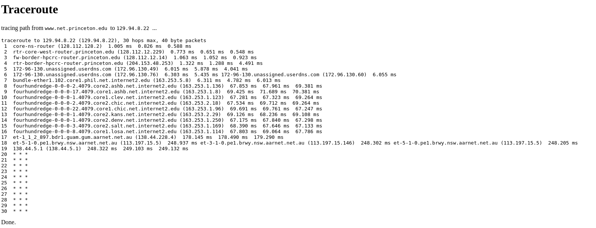

# Lab01

Disclaimer: THIS WAS EXERCISE WAS COMPLETED WITH MY HOME INTERNET.

## Exercise 2

**Output for q2**


| URL                                           | Reachable by ping        | Reachable by Web |
| --------------------------------------------- | ------------------------ | ---------------- |
| [www.google.co.uk](http://www.google.co.uk)   | Is reachable       | Yes              |
| [www.columbia.edu](http://www.columbia.edu)   | is reachable             | Yes              |
| [www.wikipedia.org](http://www.wikipedia.org) | is reachable             | Yes              |
| ec.ho                                         | is NOT reachable.  DNS non-e      | NO               |
| [hhh.gs](http://hhh.gs)                       | is reachable.            | Yes              |
| [defence.gov.au](http://defence.gov.au)       | NOT reachable by ping. Firewall blocks ICMP packet| Yes              |
| [yes.no](http://yes.no)                       | is reachable             | Yes              |
| one.one.one.one                               | is reachable             | Yes              |
| [theguardian.com](http://theguardian.com)     | is reachable             | Yes              |
| [xn--i-7iq.ws](http://xn--i-7iq.ws)           | is reachable             | Yes              |

## Exercise 3

### 3.1)


#### 3.1.1)

There are 17 routers along the path to the [usi.ch](usi.ch) from my home internet.

For UNSW, last UNSW router is router #5 (172.17.17.102). However, hop #3 may be concealed or blocked by a firewall. And hop #4 may be a virtual router on the same physical router. Therefore, the number of **PHYSICAL UNSW ROUTERS** is 3.

```
 1  cserouter1-trusted.orchestra.cse.unsw.EDU.AU (129.94.208.251)  0.258 ms  0.156 ms  0.134 ms
 2  129.94.39.17 (129.94.39.17)  0.982 ms  1.020 ms  0.956 ms
 3  * * *
 4  172.17.17.9 (172.17.17.9)  1.190 ms 172.17.17.45 (172.17.17.45)  1.435 ms 172.17.17.9 (172.17.17.9)  1.153 ms
 5  172.17.17.102 (172.17.17.102)  4.096 ms  4.085 ms 172.17.17.110 (172.17.17.110)  4.089 ms
 6  138.44.5.0 (138.44.5.0)  16.233 ms  14.831 ms  14.752 ms
 7  et-1-1-0.pe1.rsby.nsw.aarnet.net.au (113.197.15.12)  1.764 ms  1.808 ms  1.783 ms
 8  xe-1-1-0.pe1.eskp.nsw.aarnet.net.au (113.197.15.199)  3.321 ms  3.197 ms  3.178 ms
 9  et-0-3-0.pe1.prka.sa.aarnet.net.au (113.197.15.42)  20.299 ms  20.213 ms  20.196 ms
10  et-0-3-0.pe1.knsg.wa.aarnet.net.au (113.197.15.45)  46.248 ms  46.174 ms  45.969 ms
11  et-1_0_5.bdr1.sing.sin.aarnet.net.au (113.197.15.231)  92.426 ms  92.614 ms  92.506 ms
12  138.44.226.7 (138.44.226.7)  256.352 ms  256.422 ms  256.315 ms
13  ae2.mx1.lon2.uk.geant.net (62.40.98.65)  272.069 ms  271.894 ms  271.786 ms
14  ae8.mx1.par.fr.geant.net (62.40.98.107)  263.617 ms  263.569 ms  263.309 ms
15  ae7.mx1.gen.ch.geant.net (62.40.98.238)  271.353 ms  271.193 ms  271.076 ms
16  swice1-100ge-0-3-0-1.switch.ch (62.40.124.22)  273.588 ms  274.746 ms  272.978 ms
17  swiLG2-400GE-0-0-0-0.switch.ch (130.59.38.70)  276.485 ms  276.605 ms  278.114 ms
18  swiLG1-B1.switch.ch (130.59.36.77)  275.449 ms  274.842 ms  274.952 ms
19  lu-pop1-bkb02-100g-1-0-48.usi.ch (195.176.176.210)  274.932 ms  275.084 ms  275.181 ms
20  ma-pop1-dcfw01.net.ti-edu.ch (195.176.176.34)  274.961 ms  274.938 ms  275.452 ms
21  selenio.ti-edu.ch (195.176.55.64)  276.089 ms  275.713 ms  276.151 ms
```


```
% Information related to '138.44.5.0/24AS7575'

route:          138.44.5.0/24
origin:         AS7575
descr:          Australian Academic and Research Network
                Building 9
                Banks Street
mnt-by:         MAINT-AARNET-AP
last-modified:  2019-04-03T03:55:51Z
source:         APNIC
```

#### 3.1.2)

The first international router outside of Australia is Singapore as seen from the website IP geolocater [ipinfo.co](ipregistery.co)


#### 3.1.3)

The first EU router is number 13. Which is ae2.mx1.lon2.uk.geant.net (62.40.98.65) and is located in the Netherlands. Router #12 is located in Singapore and is not an EU router


### 3.2)

#### 3.2.1)

Disclaimer, UNSW's physical wifi routers contain internal/NAT routing. This means router 5 can be excluded. This means the last common router they have in common is router #7 (138.44.5.0).
The last routers that the paths have in common is router #3 with IP address: 202.90.206.100

```
Testing Link #1: 


traceroute to jhu.edu (128.220.192.230), 30 hops max, 60 byte packets
 1  * * *
 2  irb-52686.kecd1-176q4-cbl-e1.gw.unsw.edu.au (172.17.30.178)  17.206 ms  17.416 ms  18.329 ms
 3  ae4-2702.cfw1.gw.unsw.edu.au (172.17.31.52)  1.921 ms  2.217 ms  2.452 ms
 4  irb-52710.kecd1-176q4-cbl-e1.gw.unsw.edu.au (172.17.31.114)  18.061 ms  17.969 ms  17.863 ms
 5  ae2-1907.kecd2-lg11c1-pbr-c1.gw.unsw.edu.au (172.17.17.45)  3.321 ms ae2-1905.kecd1-1q16c3-pbr-c1.gw.unsw.edu.au (172.17.17.9)  3.243 ms ae2-1907.kecd2-lg11c1-pbr-c1.gw.unsw.edu.au (172.17.17.45)  3.166 ms
 6  172.17.17.102 (172.17.17.102)  48.834 ms 172.17.17.110 (172.17.17.110)  47.723 ms  47.544 ms
 7  138.44.5.0 (138.44.5.0)  2.627 ms  2.673 ms  3.010 ms
 8  et-0-3-0.pe1.bkvl.nsw.aarnet.net.au (113.197.15.147)  2.939 ms  2.959 ms  3.005 ms
 9  113.197.15.151 (113.197.15.151)  72.909 ms  72.813 ms  72.759 ms
10  138.44.228.5 (138.44.228.5)  186.950 ms  185.678 ms  187.922 ms
11  fourhundredge-0-0-0-2.4079.core2.salt.net.internet2.edu (163.253.1.115)  246.412 ms  246.261 ms  246.147 ms
12  fourhundredge-0-0-0-0.4079.core2.denv.net.internet2.edu (163.253.1.168)  245.623 ms  245.303 ms  244.698 ms
13  fourhundredge-0-0-0-0.4079.core2.kans.net.internet2.edu (163.253.1.251)  247.609 ms  246.140 ms  246.000 ms
14  fourhundredge-0-0-0-0.4079.core1.chic.net.internet2.edu (163.253.2.28)  245.743 ms  245.338 ms  244.965 ms
15  fourhundredge-0-0-0-0.4079.core1.eqch.net.internet2.edu (163.253.1.207)  245.659 ms  246.598 ms  246.548 ms
16  fourhundredge-0-0-0-0.4079.core1.clev.net.internet2.edu (163.253.1.210)  246.524 ms  246.503 ms  246.482 ms
17  fourhundredge-0-0-0-3.4079.core1.ashb.net.internet2.edu (163.253.1.122)  246.460 ms  245.806 ms  245.782 ms
18  et-0-1-8-1275.ashb-core.maxgigapop.net (206.196.177.2)  244.719 ms  244.698 ms  244.676 ms
19  206.196.178.141 (206.196.178.141)  243.681 ms  243.379 ms  273.334 ms
20  addr16212925332.testippl.jhmi.edu (162.129.253.32)  273.639 ms  273.566 ms  259.859 ms
21  162.129.255.245 (162.129.255.245)  259.689 ms  258.628 ms  258.507 ms
22  * * *
23  * * *
24  * * *
25  * * *
26  collaborate.johnshopkins.edu (128.220.192.230)  306.367 ms  306.399 ms  306.324 ms
________________________________________________________________________________________


Testing Link #2: 


traceroute to usp.br (200.144.248.41), 30 hops max, 60 byte packets
 1  * * *
 2  irb-52686.kecd1-176q4-cbl-e1.gw.unsw.edu.au (172.17.30.178)  2.869 ms  2.839 ms  4.279 ms
 3  ae4-2702.cfw1.gw.unsw.edu.au (172.17.31.52)  2.210 ms  1.798 ms  2.151 ms
 4  irb-52710.kecd1-176q4-cbl-e1.gw.unsw.edu.au (172.17.31.114)  4.159 ms  4.875 ms  4.845 ms
 5  ae2-1907.kecd2-lg11c1-pbr-c1.gw.unsw.edu.au (172.17.17.45)  4.074 ms ae2-1905.kecd1-1q16c3-pbr-c1.gw.unsw.edu.au (172.17.17.9)  4.053 ms ae2-1907.kecd2-lg11c1-pbr-c1.gw.unsw.edu.au (172.17.17.45)  4.033 ms
 6  172.17.17.102 (172.17.17.102)  4.013 ms  3.056 ms  3.623 ms
 7  138.44.5.0 (138.44.5.0)  12.681 ms  9.833 ms  11.341 ms
 8  et-1-1-0.pe1.mcqp.nsw.aarnet.net.au (113.197.15.4)  4.929 ms  3.313 ms  4.869 ms
 9  et-0_0_2.bdr1.guam.gum.aarnet.net.au (113.197.14.137)  74.478 ms  74.095 ms  74.074 ms
10  138.44.228.5 (138.44.228.5)  187.154 ms  187.574 ms  187.539 ms
11  fourhundredge-0-0-0-19.4079.core2.losa.net.internet2.edu (163.253.1.47)  235.656 ms  234.151 ms fourhundredge-0-0-0-20.4079.core2.losa.net.internet2.edu (163.253.1.49)  233.563 ms
12  fourhundredge-0-0-0-0.4079.core2.elpa.net.internet2.edu (163.253.1.202)  232.533 ms  232.946 ms  233.306 ms
13  fourhundredge-0-0-0-23.4079.core1.elpa.net.internet2.edu (163.253.1.74)  231.852 ms fourhundredge-0-0-0-0.4079.core2.hous.net.internet2.edu (163.253.1.247)  319.618 ms fourhundredge-0-0-0-22.4079.core1.elpa.net.internet2.edu (163.253.1.72)  319.499 ms
14  fourhundredge-0-0-0-23.4079.core1.hous.net.internet2.edu (163.253.1.62)  319.082 ms fourhundredge-0-0-0-0.4079.core1.hous.net.internet2.edu (163.253.2.39)  233.937 ms  233.786 ms
15  fourhundredge-0-0-0-0.4079.core1.houh.net.internet2.edu (163.253.2.24)  233.701 ms  233.631 ms  307.482 ms
16  fourhundredge-0-0-0-0.4079.core1.pens.net.internet2.edu (163.253.2.35)  307.355 ms  307.277 ms  307.203 ms
17  fourhundredge-0-0-0-0.4079.core1.jack.net.internet2.edu (163.253.1.0)  307.120 ms  307.024 ms  306.939 ms
18  64.57.28.62 (64.57.28.62)  306.893 ms  306.819 ms  307.174 ms
19  mia2-mia1.bkb.rnp.br (200.143.252.26)  307.049 ms  306.979 ms  306.905 ms
20  cce2-mia2-monet.bkb.rnp.br (170.79.213.46)  306.835 ms  306.753 ms  306.672 ms
21  sp2-cce2-tisparkle.bkb.rnp.br (170.79.213.3)  409.613 ms  409.469 ms  409.385 ms
22  as28571.saopaulo.sp.ix.br (187.16.220.3)  409.297 ms  409.210 ms  409.116 ms
23  e72361-sp2-r06-nx-swc.uspnet.usp.br (143.107.249.38)  409.035 ms  408.954 ms  408.940 ms
24  * * *
25  * * *
26  * * *
27  * * *
28  * * *
29  * * *
30  * * *
________________________________________________________________________________________


Testing Link #3: 


traceroute to ed.ac.uk (129.215.235.216), 30 hops max, 60 byte packets
 1  * * *
 2  irb-52686.kecd1-176q4-cbl-e1.gw.unsw.edu.au (172.17.30.178)  1.936 ms  2.184 ms  2.085 ms
 3  ae4-2702.cfw1.gw.unsw.edu.au (172.17.31.52)  2.966 ms  3.587 ms  2.761 ms
 4  irb-52710.kecd1-176q4-cbl-e1.gw.unsw.edu.au (172.17.31.114)  4.761 ms  4.684 ms  3.232 ms
 5  ae2-1905.kecd1-1q16c3-pbr-c1.gw.unsw.edu.au (172.17.17.9)  3.162 ms ae2-1907.kecd2-lg11c1-pbr-c1.gw.unsw.edu.au (172.17.17.45)  3.093 ms  3.026 ms
 6  172.17.17.102 (172.17.17.102)  40.299 ms 172.17.17.110 (172.17.17.110)  39.413 ms  39.467 ms
 7  138.44.5.0 (138.44.5.0)  3.186 ms  2.491 ms  3.547 ms
 8  et-1-1-0.pe1.mcqp.nsw.aarnet.net.au (113.197.15.4)  3.224 ms  4.056 ms  3.980 ms
 9  et-0-3-0.pe1.eskp.nsw.aarnet.net.au (113.197.15.3)  4.281 ms  4.208 ms  4.210 ms
10  et-0-3-0.pe1.prka.sa.aarnet.net.au (113.197.15.42)  22.064 ms  21.856 ms  21.623 ms
11  et-0-3-0.pe1.knsg.wa.aarnet.net.au (113.197.15.45)  49.774 ms  49.540 ms  49.188 ms
12  et-2-1-2.bdr2.sing.sin.aarnet.net.au (113.197.15.247)  93.210 ms  93.848 ms  93.386 ms
13  ae1.bdr1.sing.sin.aarnet.net.au (113.197.15.234)  93.029 ms  93.723 ms  94.150 ms
14  138.44.226.7 (138.44.226.7)  256.971 ms  256.505 ms  256.781 ms
15  ae2.mx1.lon2.uk.geant.net (62.40.98.65)  258.175 ms  308.433 ms  308.312 ms
16  janet-bckp-gw.mx1.lon2.uk.geant.net (62.40.125.58)  310.399 ms  310.330 ms  310.261 ms
17  ae31.erdiss-sbr2.ja.net (146.97.33.22)  310.197 ms  310.133 ms  310.066 ms
18  ae29.manckh-sbr2.ja.net (146.97.33.42)  310.003 ms  309.935 ms  294.885 ms
19  ae31.glasss-sbr1.ja.net (146.97.33.54)  294.834 ms  294.803 ms  294.771 ms
20  ae29.edinat-rbr2.ja.net (146.97.38.38)  294.738 ms  268.917 ms  307.696 ms
21  ae25.edinkb-rbr2.ja.net (146.97.74.34)  308.127 ms  410.768 ms  410.609 ms
22  university-of-edinburgh.ja.net (146.97.156.78)  410.496 ms  410.399 ms  410.301 ms
23  remote.net.ed.ac.uk (192.41.103.209)  410.198 ms  410.090 ms  409.990 ms
24  * * *
25  * * *
26  * * *
27  * * *
28  * * *
29  * * *
30  * * *
________________________________________________________________________________________

```

Further information about this router reveals that

```
whois 138.44.5.0

#
# ARIN WHOIS data and services are subject to the Terms of Use
# available at: https://www.arin.net/resources/registry/whois/tou/
#
# If you see inaccuracies in the results, please report at
# https://www.arin.net/resources/registry/whois/inaccuracy_reporting/
#
# Copyright 1997-2024, American Registry for Internet Numbers, Ltd.
#


NetRange:       138.44.0.0 - 138.44.255.255
CIDR:           138.44.0.0/16
NetName:        APNIC-ERX-138-44-0-0
NetHandle:      NET-138-44-0-0-1
Parent:         NET138 (NET-138-0-0-0-0)
NetType:        Early Registrations, Transferred to APNIC
OriginAS:       
Organization:   Asia Pacific Network Information Centre (APNIC)
RegDate:        2003-12-11
Updated:        2009-10-08
Comment:        This IP address range is not registered in the ARIN database.
Comment:        This range was transferred to the APNIC Whois Database as
Comment:        part of the ERX (Early Registration Transfer) project.
Comment:        For details, refer to the APNIC Whois Database via
Comment:        WHOIS.APNIC.NET or http://wq.apnic.net/apnic-bin/whois.pl
Comment:        
Comment:        ** IMPORTANT NOTE: APNIC is the Regional Internet Registry
Comment:        for the Asia Pacific region.  APNIC does not operate networks
Comment:        using this IP address range and is not able to investigate
Comment:        spam or abuse reports relating to these addresses.  For more
Comment:        help, refer to http://www.apnic.net/apnic-info/whois_search2/abuse-and-spamming
Ref:            https://rdap.arin.net/registry/ip/138.44.0.0

ResourceLink:  http://wq.apnic.net/whois-search/static/search.html
ResourceLink:  whois.apnic.net


OrgName:        Asia Pacific Network Information Centre
OrgId:          APNIC
Address:        PO Box 3646
City:           South Brisbane
StateProv:      QLD
PostalCode:     4101
Country:        AU
RegDate:        
Updated:        2012-01-24
Ref:            https://rdap.arin.net/registry/entity/APNIC

ReferralServer:  whois://whois.apnic.net
ResourceLink:  http://wq.apnic.net/whois-search/static/search.html

OrgTechHandle: AWC12-ARIN
OrgTechName:   APNIC Whois Contact
OrgTechPhone:  +61 7 3858 3188 
OrgTechEmail:  search-apnic-not-arin@apnic.net
OrgTechRef:    https://rdap.arin.net/registry/entity/AWC12-ARIN

OrgAbuseHandle: AWC12-ARIN
OrgAbuseName:   APNIC Whois Contact
OrgAbusePhone:  +61 7 3858 3188 
OrgAbuseEmail:  search-apnic-not-arin@apnic.net
OrgAbuseRef:    https://rdap.arin.net/registry/entity/AWC12-ARIN

```

#### 3.2.2)

Hop count and physical distance is weakly correlated. Since the hop count to Sao Paulo is the same to Edinburgh despite Sau Paulo being closer to Sydney.

Additionally, the difference in hopcount between New York and Sau paulo and Edin burgh is close (by 3).

Ultimately, hop count and physical distance must be weakly correlated as there must be other factors that contribute to varying hop count such as queuing or transmission delay, etc. (Scepticism is required here because the sample size is small)

| # | Link     | Hops | Location  | Euclidean Distance from Sydney(km) |
|---|----------|------|-----------|------------------------------------|
| 1 | jhu.edu  | 26   | New York  | 15,728                             |
| 2 | usp.br   | 23   | Sao Paulo | 14,235                             |
| 3 | ed.ac.uk | 23   | Edinburgh | 17,006                             |

### 3.3)

#### 3.3.1)

My public ip address is 116.255.12.95 as follows:


##### Output from [https://www.net.princeton.edu/traceroute.html](https://www.net.princeton.edu/traceroute.html) to my IP address



##### Output from <https://www.as13030.net> to my IP address

```
traceroute to 129.94.8.22 (129.94.8.22), 30 hops max, 60 byte packets
 1  r2win7.core.init7.net (213.144.137.193) [AS13030]  1.147 ms  1.422 ms  1.813 ms
 2  r1win1.core.init7.net (5.180.134.125) [AS13030]  1.084 ms  1.268 ms  1.571 ms
 3  r1win7.core.init7.net (5.180.134.122) [AS13030]  1.041 ms  1.331 ms  1.722 ms
 4  r1win9.core.init7.net (5.180.135.25) [AS13030]  0.987 ms  1.165 ms  1.458 ms
 5  r1zrh10.core.init7.net (5.180.135.56) [AS13030]  1.463 ms  1.817 ms  2.327 ms
 6  r1glb3.core.init7.net (5.180.135.59) [AS13030]  1.222 ms  1.344 ms  1.517 ms
 7  r2zrh5.core.init7.net (5.180.135.69) [AS13030]  1.401 ms  1.767 ms  1.502 ms
 8  r2zrh2.core.init7.net (5.180.135.232) [AS13030]  5.543 ms  5.661 ms  6.131 ms
 9  r1fra3.core.init7.net (5.180.135.173) [AS13030]  7.163 ms  7.393 ms  7.861 ms
10  xe-1-2-0.mpr1.fra4.de.above.net (80.81.194.26) [*]  7.128 ms  7.180 ms  7.173 ms
11  * ae12.cs1.fra6.de.eth.zayo.com (64.125.26.172) [*]  139.900 ms  139.953 ms
12  * * *
13  * * *
14  * * *
15  * * *
16  * * *
17  * * *
18  ae2.cs1.sea1.us.eth.zayo.com (64.125.29.26) [*]  139.880 ms  145.394 ms  145.382 ms
19  ae27.mpr1.sea1.us.zip.zayo.com (64.125.29.1) [*]  139.715 ms  139.706 ms  139.697 ms
20  64.125.193.130.i223.above.net (64.125.193.130) [*]  139.680 ms  139.668 ms  139.612 ms
21  et-10-0-5.170.pe1.brwy.nsw.aarnet.net.au (113.197.15.62) [AS7575]  279.492 ms  279.439 ms  279.421 ms
22  138.44.5.1 (138.44.5.1) [AS7575]  279.371 ms  279.389 ms  279.353 ms
23  * * *
24  * * *
25  * * *
26  * * *
27  * * *
28  * * *
29  * * *
30  * * *
```

IP address of the selected links:
| Link                          | IP Address      |
|-------------------------------|-----------------|
| <https://www.net.princeton.edu> | 128.112.128.55  |
| <https://www.as13030.net>       | 213.144.137.198 |
|                               |                 |

##### My output to [www.net.princeton.edu](128.112.128.55)

```
Testing Link #1 : 128.112.128.55 


traceroute to 128.112.128.55 (128.112.128.55), 30 hops max, 60 byte packets
 1  * * *
 2  irb-52686.kecd1-176q4-cbl-e1.gw.unsw.edu.au (172.17.30.178)  7.437 ms  7.552 ms  8.587 ms
 3  ae4-2702.cfw1.gw.unsw.edu.au (172.17.31.52)  3.059 ms  3.041 ms  2.300 ms
 4  irb-52710.kecd1-176q4-cbl-e1.gw.unsw.edu.au (172.17.31.114)  8.515 ms  8.498 ms  8.481 ms
 5  ae2-1907.kecd2-lg11c1-pbr-c1.gw.unsw.edu.au (172.17.17.45)  2.954 ms  2.938 ms ae2-1905.kecd1-1q16c3-pbr-c1.gw.unsw.edu.au (172.17.17.9)  2.921 ms
 6  172.17.17.110 (172.17.17.110)  2.903 ms  2.802 ms 172.17.17.102 (172.17.17.102)  2.046 ms
 7  138.44.5.0 (138.44.5.0)  6.510 ms  6.491 ms  6.472 ms
 8  et-1-1-0.pe1.mcqp.nsw.aarnet.net.au (113.197.15.4)  3.163 ms  3.064 ms  3.681 ms
 9  et-0_0_2.bdr1.guam.gum.aarnet.net.au (113.197.14.137)  72.765 ms  72.199 ms  73.247 ms
10  138.44.228.5 (138.44.228.5)  187.279 ms  187.145 ms  188.028 ms
11  fourhundredge-0-0-0-2.4079.core2.salt.net.internet2.edu (163.253.1.115)  249.426 ms  249.404 ms  249.388 ms
12  fourhundredge-0-0-0-22.4079.core1.salt.net.internet2.edu (163.253.1.30)  248.568 ms  248.320 ms fourhundredge-0-0-0-0.4079.core2.denv.net.internet2.edu (163.253.1.168)  249.434 ms
13  fourhundredge-0-0-0-0.4079.core1.denv.net.internet2.edu (163.253.1.170)  247.155 ms  248.664 ms  248.270 ms
14  fourhundredge-0-0-0-0.4079.core1.kans.net.internet2.edu (163.253.1.243)  248.148 ms  307.285 ms  307.110 ms
15  fourhundredge-0-0-0-3.4079.core2.chic.net.internet2.edu (163.253.1.244)  306.827 ms  291.939 ms  291.867 ms
16  fourhundredge-0-0-0-3.4079.core2.eqch.net.internet2.edu (163.253.2.19)  291.827 ms  248.224 ms  249.951 ms
17  fourhundredge-0-0-0-0.4079.core2.clev.net.internet2.edu (163.253.2.16)  248.783 ms  248.701 ms  248.620 ms
18  fourhundredge-0-0-0-3.4079.core2.ashb.net.internet2.edu (163.253.1.138)  248.532 ms  248.008 ms  336.718 ms
19  fourhundredge-0-0-0-1.4079.core1.phil.net.internet2.edu (163.253.1.137)  336.570 ms  336.490 ms  336.418 ms
20  163.253.5.9 (163.253.5.9)  336.165 ms  336.096 ms  336.024 ms
21  172.96.130.54 (172.96.130.54)  336.039 ms  335.915 ms  291.235 ms
22  fw-border-87-router.princeton.edu (204.153.48.2)  291.173 ms  291.021 ms  291.026 ms
23  rtr-core-east-router.princeton.edu (128.112.12.9)  291.325 ms  291.258 ms  291.127 ms
24  core-ns-router.princeton.edu (128.112.12.226)  249.701 ms  249.618 ms  250.087 ms
25  www.net.princeton.edu (128.112.128.55)  249.445 ms  249.462 ms  249.412 ms
________________________________________________________________________________________

```

##### My output to [www.as13030.net](213.144.137.198)

```
Testing Link #2: 

Testing Link #2 : 213.144.137.198 


traceroute to 213.144.137.198 (213.144.137.198), 30 hops max, 60 byte packets
 1  * * *
 2  irb-52686.kecd1-176q4-cbl-e1.gw.unsw.edu.au (172.17.30.178)  1.805 ms  2.119 ms  3.955 ms
 3  ae4-2702.cfw1.gw.unsw.edu.au (172.17.31.52)  2.323 ms  2.297 ms  2.274 ms
 4  irb-52710.kecd1-176q4-cbl-e1.gw.unsw.edu.au (172.17.31.114)  3.853 ms  3.830 ms  3.800 ms
 5  ae2-1907.kecd2-lg11c1-pbr-c1.gw.unsw.edu.au (172.17.17.45)  3.774 ms ae2-1905.kecd1-1q16c3-pbr-c1.gw.unsw.edu.au (172.17.17.9)  3.751 ms ae2-1907.kecd2-lg11c1-pbr-c1.gw.unsw.edu.au (172.17.17.45)  3.729 ms
 6  172.17.17.110 (172.17.17.110)  3.708 ms  3.041 ms 172.17.17.102 (172.17.17.102)  2.700 ms
 7  138.44.5.0 (138.44.5.0)  5.547 ms  6.153 ms  6.119 ms
 8  et-0-3-0.pe1.bkvl.nsw.aarnet.net.au (113.197.15.147)  3.382 ms  3.705 ms  3.320 ms
 9  xe-0-2-5.bdr1.b.sea.aarnet.net.au (202.158.194.121)  142.422 ms  142.398 ms  142.057 ms
10  xe-4-1-1.mpr1.sea1.us.above.net (64.125.193.129)  142.355 ms  142.334 ms  141.659 ms
11  ae27.cs1.sea1.us.eth.zayo.com (64.125.29.0)  263.948 ms  263.835 ms  264.203 ms
12  * * *
13  * * *
14  * * *
15  ae4.mpr1.lhr15.uk.zip.zayo.com (64.125.28.195)  431.304 ms  431.264 ms  431.224 ms
16  linx-1.init7.net (195.66.224.175)  431.906 ms  361.540 ms  361.420 ms
17  r2lon2.core.init7.net (5.180.135.248)  361.373 ms  306.227 ms  306.067 ms
18  r2fra3.core.init7.net (5.180.135.129)  306.916 ms  306.461 ms  306.282 ms
19  r1fra3.core.init7.net (80.81.192.67)  306.181 ms  306.089 ms  307.856 ms
20  r2zrh2.core.init7.net (5.180.135.172)  307.815 ms  306.998 ms  306.965 ms
21  r2zrh5.core.init7.net (5.180.135.233)  306.940 ms  306.921 ms  306.898 ms
22  r1glb3.core.init7.net (5.180.135.68)  306.983 ms  306.860 ms  306.787 ms
23  r1zrh10.core.init7.net (5.180.135.58)  306.719 ms  306.651 ms  306.584 ms
24  r1win9.core.init7.net (5.180.135.57)  306.513 ms  306.039 ms  305.917 ms
25  r1win7.core.init7.net (5.180.135.24)  306.261 ms  306.188 ms  306.121 ms
26  r1win1.core.init7.net (5.180.134.123)  306.051 ms  305.984 ms  307.638 ms
27  r2win7.core.init7.net (5.180.134.124)  307.510 ms  307.380 ms  307.304 ms
28  * * *
29  * * *
30  * * *
________________________________________________________________________________________
```

#### 3.3.2)

The paths of the reverse and forward route are different.

Albeit, as seen above the reverse route goes through some similar routers with the forward route as with the case for <aarnet> which is Australia's national research and education network. However, for both routes there are many routers which are different because of the different IP addresses.

Something to note is the close proximity of the IP addresses for <https://init.7>, which may imply a server hosting many machines to achieve this.

#### 3.3.3)

Standard routers appear if the IP address has not been translated. This is the case with <https://www.net.princeton.edu/traceroute.html> . However, it appears with the  <https://init.7> and UNSW have used a translated IP (NAT Gateway) which may explain why the terminating IP addresses are different.

## Exercise 4

### Data

#### <http://cdu.edu.au>

#### Delay vs Time and Packet Number


#### Delay vs. Packet Size


#### Average and Min delay for packet size

| Packet-Size | Avg    | Min    |
| ----------- | ------ | ------ |
| 50          | 71.14  | 61.694 |
| 250         | 67.106 | 61.878 |
| 500         | 68.239 | 62.84  |
| 750         | 67.265 | 63.326 |
| 1000        | 67.785 | 62.549 |
| 1250        | 67.948 | 62.787 |
| 1500        | 69.891 | 62.854 |

#### <http://usp.br>

#### Delay vs Time and Packet Number


#### Delay vs. Packet Size


#### Average and Min delay for packet size

| Packet-Size | Avg     | Min     |
| ----------- | ------- | ------- |
| 50          | 392.834 | 334.572 |
| 250         | 404.478 | 332.872 |
| 500         | 397.889 | 335.137 |
| 750         | 389.037 | 333.947 |
| 1000        | 397.218 | 335.194 |
| 1250        | 397.085 | 335.352 |
| 1500        | 395.499 | 333.484 |

#### <http://ed.ac.uk>

#### Delay vs Time and Packet Number


#### Delay vs. Packet Size


#### Average and Min delay for packet size

| Packet-Size | Avg     | Min     |
| ----------- | ------- | ------- |
| 50          | 350.898 | 284.239 |
| 250         | 345.494 | 291.038 |
| 500         | 345.516 | 284.403 |
| 750         | 340.107 | 288.637 |
| 1000        | 339.109 | 286.988 |
| 1250        | 357.529 | 289.484 |
| 1500        | 339.793 | 284.49  |

### 4.1)

| Link                            | Location  | Euclidean Distance from Sydney(km) | Time to Destination(s) | Time to destination (ms) | Speed of light (m/s)  | 300000000 |
| ------------------------------- | --------- | ---------------------------------- | ---------------------- | ------------------------ | --------------------- | --------- |
| [cdu.edu.au](http://cdu.edu.au) | Darwin    | 3,149                              | 0.01049666667          | 10.49666667              | Speed of light (km/s) | 300000    |
| [usp.br](http://usp.br)         | Sao Paulo | 14,235                             | 0.04745                | 47.45                    |                       |           |
| [ed.ac.uk](http://ed.ac.uk)     | Edinburgh | 17,006                             | 0.05668666667          | 56.68666667              |                       |           |

### 4.2)


### 4.3)

Possible reasons that the y-axis is greater than two are:

1) Transmission delay incurred along the route because each node(router) needs to manage other packets.
2) Propogation speed of a packet is not actually $3*10^8 m/s$. It is more closer to $2*10^8 m/s$ because the speed of light (a packet) will travel slower in fibre optic (a different material)
3) Possible Processing and Queuing delay from individual routers as they will be managing other packets
4) ISP level routing may lead to paths that actually have higher delay

### 4.4)

Delay to the destination will vary over time. This is because the nodes/routers to the destination will have manage other packets and this means that factors such as processing, queueing and transmission time will also wildy vary. As such, each time a packet is sent to the destination it's RTT will vary.

### 4.5)

| # | Delay type   | Definition                                                            | Formula |
|---|--------------|-----------------------------------------------------------------------|---------|
| 1 | Processing   | time required to examine the packet headers and determine redirection |         |
| 2 | Queueing     | time spent by the packet waiting to be transmitted onto the link      |         |
| 3 | Transmission | time required to push the packet into the link                        | $(L / R)$   |
| 4 | Propogation  | time spent by the packet travelling from the beginning to end node    | $(d / v)$   |

Where:

$R$ = Transmission rate of the link

$L$ = The packet length in bits

$d$ = The distance between two nodes (routers)

$v$ = The speed of light in a physical medium

Transmission delay depends on the size of the packet $L$.

Processing delay can also depend on the packet size but to a smaller degree than transmission delay as it is in the order of microseconds[Computer Networking. Kurose page 64] and much smaller than a transmission delay.

The others do not.
