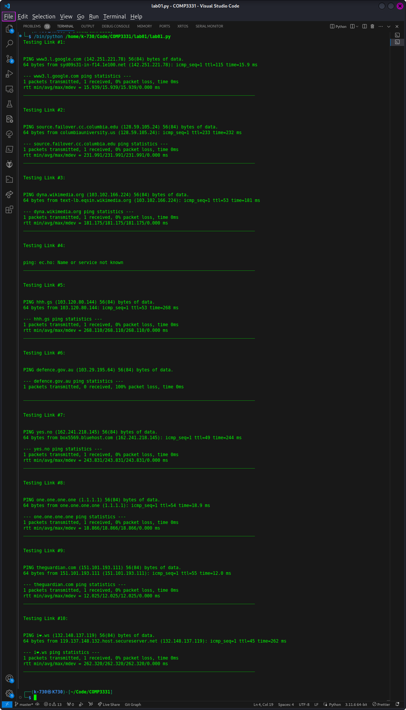
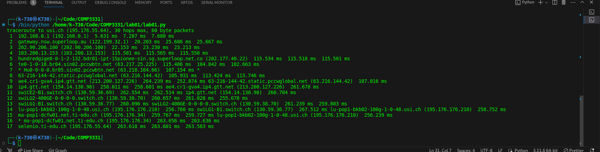
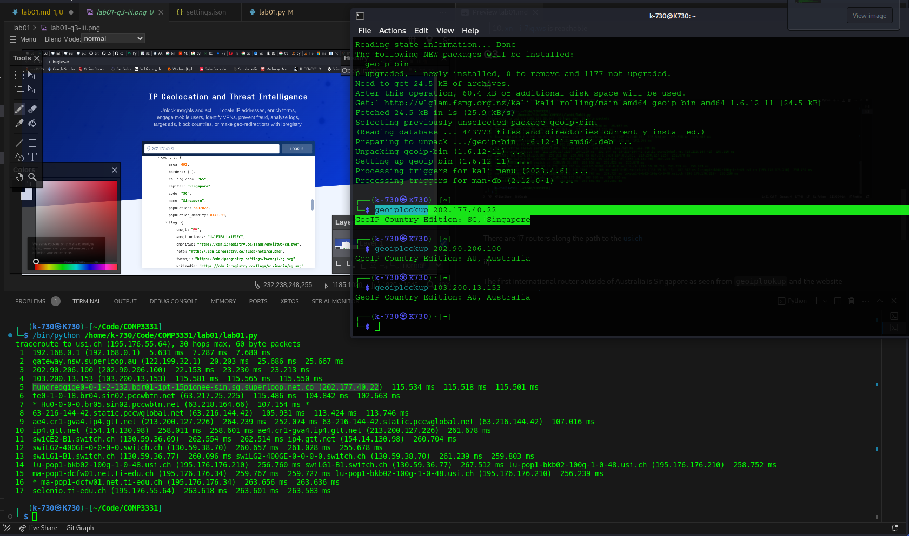
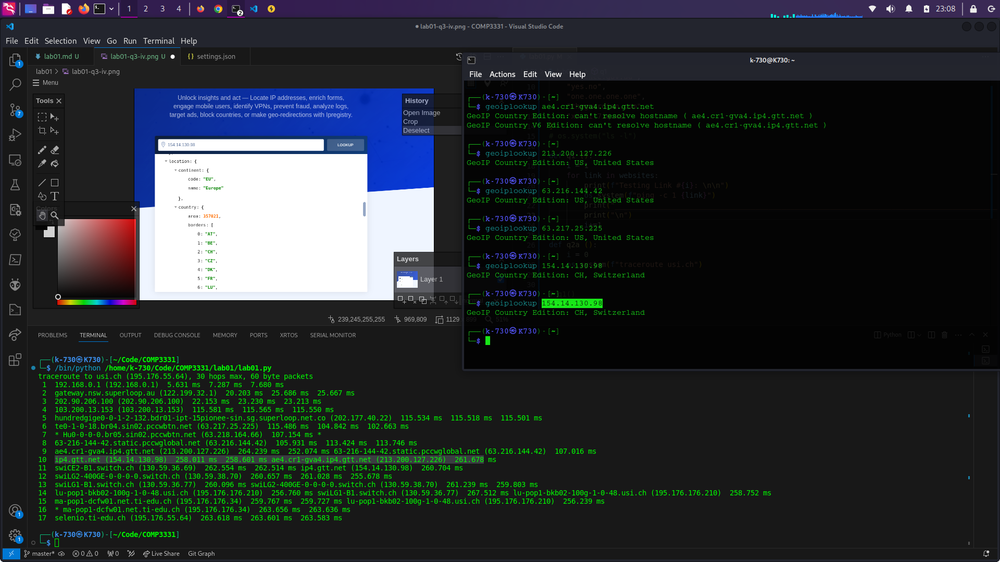
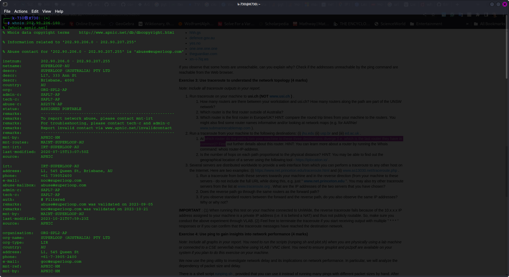
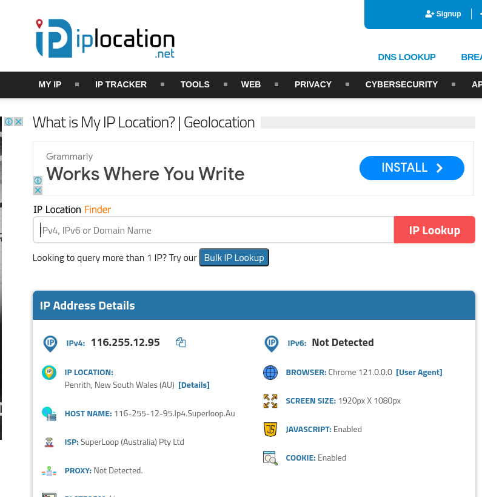
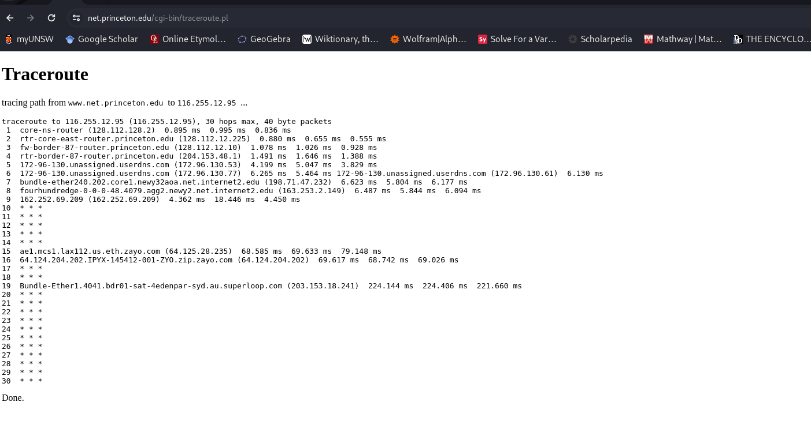
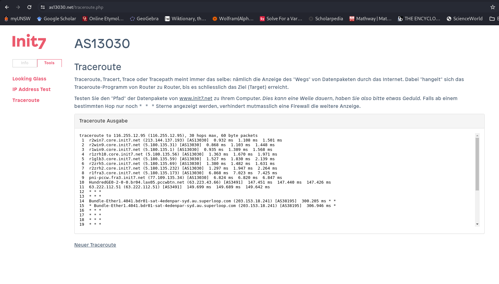
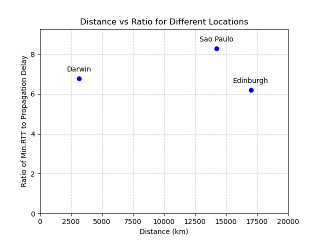

# Lab01

## Q2

**Output for q2**


| URL                                           | Reachable by ping        | Reachable by Web |
| --------------------------------------------- | ------------------------ | ---------------- |
| [www.google.co.uk](http://www.google.co.uk)   | Is reachable       | Yes              |
| [www.columbia.edu](http://www.columbia.edu)   | is reachable             | Yes              |
| [www.wikipedia.org](http://www.wikipedia.org) | is reachable             | Yes              |
| ec.ho                                         | is NOT reachable.        | NO               |
| [hhh.gs](http://hhh.gs)                       | is reachable.            | Yes              |
| [defence.gov.au](http://defence.gov.au)       | is not reachable by ping | Yes              |
| [yes.no](http://yes.no)                       | is reachable             | Yes              |
| one.one.one.one                               | is reachable             | Yes              |
| [theguardian.com](http://theguardian.com)     | is reachable             | Yes              |
| [xn--i-7iq.ws](http://xn--i-7iq.ws)           | is reachable             | Yes              |

## Q3

### a)



#### i)

There are 16 routers along the path to the [usi.ch](usi.ch). (excluding the destination router)

#### ii)

The first international router outside of Australia is Singapore as seen from `geoiplookup` and the website geolocater [ipregistery.co](ipregistery.co)



#### iii)

The first EU router is number 10. Which is ip4.gtt.net (154.14.130.98).


### b)

#### i)

The last routers that the routes have in common is #3 with IP address: 202.90.206.100

```
Testing Link #1: 


traceroute to jhu.edu (128.220.192.230), 30 hops max, 60 byte packets
 1  192.168.0.1 (192.168.0.1)  15.191 ms  21.288 ms  27.416 ms
 2  gateway.nsw.superloop.au (122.199.32.1)  46.606 ms  46.539 ms  46.475 ms
 3  202.90.206.100 (202.90.206.100)  46.410 ms  46.346 ms  46.281 ms
 4  Bundle-Ether31.bdr02-ipt-47bourke-syd.au.superloop.com (103.200.13.67)  68.853 ms  87.230 ms  87.166 ms
 5  HundredGigE0-0-1-2.122.bdr01-ipt-220queen-akl.nz.superloop.com (111.118.196.23)  79.248 ms  79.183 ms  79.119 ms
 6  as6939.akl.ix.nz (43.243.21.17)  87.803 ms  34.513 ms  35.063 ms
 7  100ge0-32.core1.akl2.he.net (184.104.196.117)  39.621 ms  39.571 ms  39.623 ms
 8  100ge0-28.core1.pdx3.he.net (184.104.188.77)  240.374 ms  240.333 ms  240.294 ms
 9  * * *
10  * * *
11  * * port-channel15.core2.sea1.he.net (184.104.199.69)  242.199 ms
12  * * *
13  * * *
14  * johns-hopkins-university.e0-2.switch2.ash1.he.net (209.51.168.62)  327.658 ms  309.595 ms
15  addr16212925394.testippl.jhmi.edu (162.129.253.94)  306.398 ms * *
16  * addr16212925394.testippl.jhmi.edu (162.129.253.94)  297.923 ms  297.888 ms
17  addr16212925394.testippl.jhmi.edu (162.129.253.94)  297.854 ms 162.129.255.245 (162.129.255.245)  300.153 ms *
18  * * *
19  * * *
20  * * *
21  collaborate.johnshopkins.edu (128.220.192.230)  328.693 ms * *
________________________________________________________________________________________


Testing Link #2: 


traceroute to usp.br (200.144.248.41), 30 hops max, 60 byte packets
 1  192.168.0.1 (192.168.0.1)  2.067 ms  2.085 ms  2.005 ms
 2  gateway.nsw.superloop.au (122.199.32.1)  12.071 ms  19.326 ms  19.336 ms
 3  202.90.206.100 (202.90.206.100)  19.283 ms  19.263 ms  19.236 ms
 4  Bundle-Ether30.bdr02-ipt-639garde-syd.au.superloop.com (103.200.13.65)  19.199 ms  19.174 ms  19.153 ms
 5  8.245.132.225 (8.245.132.225)  45.071 ms  45.049 ms  45.028 ms
 6  NTT-level3-Syndey1.Level3.net (4.68.38.206)  28.267 ms  9.160 ms  9.004 ms
 7  ae-1.r20.sydnau05.au.bb.gin.ntt.net (129.250.2.133)  17.019 ms  16.985 ms  16.966 ms
 8  ae-5.r24.lsanca07.us.bb.gin.ntt.net (129.250.2.52)  226.123 ms  226.107 ms  226.090 ms
 9  ae-3.r22.dllstx14.us.bb.gin.ntt.net (129.250.7.68)  226.443 ms  226.425 ms  226.409 ms
10  ae-2.r22.miamfl02.us.bb.gin.ntt.net (129.250.2.218)  268.188 ms  233.320 ms  233.275 ms
11  ae-0.a02.miamfl02.us.bb.gin.ntt.net (129.250.2.4)  233.253 ms ae-0.a03.miamfl02.us.bb.gin.ntt.net (129.250.7.44)  233.234 ms ae-0.a02.miamfl02.us.bb.gin.ntt.net (129.250.2.4)  233.216 ms
12  xe-1-5-0-2.a02.miamfl02.us.ce.gin.ntt.net (129.250.200.158)  234.152 ms xe-3-3-0-1.a03.miamfl02.us.ce.gin.ntt.net (129.250.202.94)  225.462 ms xe-1-5-0-2.a02.miamfl02.us.ce.gin.ntt.net (129.250.200.158)  229.025 ms
13  mia2-mia1.bkb.rnp.br (200.143.252.26)  245.074 ms cce2-mia2-monet.bkb.rnp.br (170.79.213.46)  290.252 ms mia2-mia1.bkb.rnp.br (200.143.252.26)  229.121 ms
14  cce2-mia2-monet.bkb.rnp.br (170.79.213.46)  302.256 ms 170.79.212.249 (170.79.212.249)  337.082 ms  337.038 ms
15  170.79.212.249 (170.79.212.249)  339.438 ms csp2-csp1-100g-via-sp2.bkb.rnp.br (170.79.213.233)  335.766 ms 170.79.212.249 (170.79.212.249)  337.233 ms
16  csp2-csp1-100g-via-sp2.bkb.rnp.br (170.79.213.233)  342.245 ms  342.225 ms e72361-sp2-r06-nx-swc.uspnet.usp.br (143.107.249.38)  350.788 ms
17  * as28571.saopaulo.sp.ix.br (187.16.220.3)  347.215 ms  345.300 ms
18  * e72361-sp2-r06-nx-swc.uspnet.usp.br (143.107.249.38)  349.355 ms  337.955 ms
19  * * *
20  * * *
21  * * *
22  * * *
23  * * *
24  * * *
25  * * *
26  * * *
27  * * *
28  * * *
29  * * *
30  * * *
________________________________________________________________________________________


Testing Link #3: 


traceroute to ed.ac.uk (129.215.235.217), 30 hops max, 60 byte packets
 1  192.168.0.1 (192.168.0.1)  2.158 ms  3.556 ms  3.505 ms
 2  gateway.nsw.superloop.au (122.199.32.1)  15.328 ms  16.180 ms  15.236 ms
 3  202.90.206.100 (202.90.206.100)  15.191 ms  15.144 ms  10.882 ms
 4  103.200.13.153 (103.200.13.153)  338.927 ms  338.883 ms  338.838 ms
 5  hundredgige0-0-1-2-132.bdr01-ipt-15pionee-sin.sg.superloop.net.co (202.177.40.22)  338.793 ms  338.748 ms  338.700 ms
 6  202-130-207-34.ip4.superloop.au (202.130.207.34)  338.657 ms  323.728 ms  293.988 ms
 7  mei-b5-link.ip.twelve99.net (62.115.176.152)  293.918 ms  293.884 ms  293.852 ms
 8  prs-bb1-link.ip.twelve99.net (62.115.124.54)  293.819 ms prs-bb2-link.ip.twelve99.net (62.115.124.56)  293.749 ms prs-bb1-link.ip.twelve99.net (62.115.124.54)  293.700 ms
 9  * * *
10  ldn-b2-link.ip.twelve99.net (62.115.122.189)  326.696 ms ldn-b2-link.ip.twelve99.net (62.115.120.239)  326.622 ms  326.604 ms
11  jisc-ic-345131.ip.twelve99-cust.net (62.115.175.131)  326.586 ms  326.570 ms  326.554 ms
12  ae24.londhx-sbr1.ja.net (146.97.35.197)  326.596 ms  326.579 ms  326.562 ms
13  ae29.londpg-sbr2.ja.net (146.97.33.2)  326.486 ms  326.468 ms  326.451 ms
14  ae31.erdiss-sbr2.ja.net (146.97.33.22)  326.493 ms  311.451 ms  311.333 ms
15  ae29.manckh-sbr2.ja.net (146.97.33.42)  311.266 ms  311.201 ms  311.133 ms
16  ae31.glasss-sbr1.ja.net (146.97.33.54)  311.067 ms  311.005 ms  310.938 ms
17  ae29.edinat-rbr2.ja.net (146.97.38.38)  310.934 ms  310.823 ms  310.735 ms
18  ae25.edinkb-rbr2.ja.net (146.97.74.34)  310.668 ms  310.606 ms  405.933 ms
19  university-of-edinburgh.ja.net (146.97.156.78)  405.820 ms  405.753 ms  405.689 ms
20  remote.net.ed.ac.uk (192.41.103.209)  405.623 ms  405.561 ms  405.496 ms
21  * * *
22  * * *
23  * * *
24  * * *
25  * * *
26  * * *
27  * * *
28  * * *
29  * * *
30  * * *
```

Further information about this router reveals my Internet Service Provider with SuperLoop. It is apparently located in Brisbane


#### ii)

Hop count and physical distance is weakly correlated. Since the hop count to Edinburgh is lower than to New York, despite New York being closer to Sydney.

However, it also seems that the hop count to Sau Paulo is the lowest but only by a small amount when compared to Edinburgh.

Ultimately, hop count and physical distance must be weakly correlated as there must be other factors that contribute to varying hop count. (Scepticism is required here because the sample size is small)

| # | Link     | Hops | Location  | Euclidean Distance from Sydney(km) |
|---|----------|------|-----------|------------------------------------|
| 1 | jhu.edu  | 21   | New York  | 15,728                             |
| 2 | usp.br   | 18   | Sao Paulo | 14,235                             |
| 3 | ed.ac.uk | 20   | Edinburgh | 17,006                             |

### c)

#### i)

My public ip address is as follows:


##### Output from [https://www.net.princeton.edu/traceroute.html](https://www.net.princeton.edu/traceroute.html) to my IP address



##### Output from <https://www.as13030.net> to my IP address



IP address of the selected links:
| Link                          | IP Address      |
|-------------------------------|-----------------|
| <https://www.net.princeton.edu> | 128.112.128.55  |
| <https://www.as13030.net>       | 213.144.137.198 |
|                               |                 |

##### My output to 128.112.128.55

```
Testing Link #1: 


traceroute to 128.112.128.55 (128.112.128.55), 30 hops max, 60 byte packets
 1  192.168.0.1 (192.168.0.1)  3.304 ms  3.253 ms  3.225 ms
 2  gateway.nsw.superloop.au (122.199.32.1)  13.004 ms  17.284 ms  17.259 ms
 3  202.90.206.100 (202.90.206.100)  17.236 ms  17.211 ms  17.187 ms
 4  Bundle-Ether31.bdr02-ipt-47bourke-syd.au.superloop.com (103.200.13.67)  171.438 ms  171.416 ms  171.390 ms
 5  103.200.13.168 (103.200.13.168)  171.366 ms  171.345 ms  171.322 ms
 6  ae7.er3.lax112.us.zip.zayo.com (64.124.204.201)  167.721 ms  169.392 ms  169.347 ms
 7  ae1.cs1.lax112.us.eth.zayo.com (64.125.28.234)  169.325 ms  160.977 ms  160.932 ms
 8  * * *
 9  lsan0.tr-cps.internet2.edu (206.223.123.199)  171.397 ms  168.440 ms  169.764 ms
10  fourhundredge-0-0-0-0.4079.core1.losa.net.internet2.edu (163.253.1.18)  241.399 ms  237.475 ms  241.261 ms
11  fourhundredge-0-0-0-2.4079.core2.salt.net.internet2.edu (163.253.1.115)  237.342 ms  237.277 ms  236.843 ms
12  fourhundredge-0-0-0-23.4079.core1.salt.net.internet2.edu (163.253.1.32)  235.586 ms fourhundredge-0-0-0-0.4079.core2.denv.net.internet2.edu (163.253.1.168)  240.552 ms  240.479 ms
13  fourhundredge-0-0-0-0.4079.core1.denv.net.internet2.edu (163.253.1.170)  241.289 ms  241.116 ms  234.982 ms
14  fourhundredge-0-0-0-0.4079.core1.kans.net.internet2.edu (163.253.1.243)  232.442 ms  228.669 ms  228.619 ms
15  fourhundredge-0-0-0-3.4079.core2.chic.net.internet2.edu (163.253.1.244)  234.947 ms  235.354 ms  235.320 ms
16  fourhundredge-0-0-0-3.4079.core2.eqch.net.internet2.edu (163.253.2.19)  243.913 ms  242.835 ms  238.887 ms
17  fourhundredge-0-0-0-0.4079.core2.clev.net.internet2.edu (163.253.2.16)  238.835 ms  237.978 ms  237.925 ms
18  fourhundredge-0-0-0-3.4079.core2.ashb.net.internet2.edu (163.253.1.138)  239.343 ms  237.192 ms  247.316 ms
19  fourhundredge-0-0-0-1.4079.core1.phil.net.internet2.edu (163.253.1.137)  242.496 ms  237.738 ms  244.364 ms
20  198.71.47.99 (198.71.47.99)  245.536 ms  229.349 ms  234.627 ms
21  172-96-130.unassigned.userdns.com (172.96.130.54)  239.439 ms  234.492 ms  239.305 ms
22  fw-border-87-router.princeton.edu (204.153.48.2)  232.358 ms  227.431 ms  243.333 ms
23  rtr-core-east-router.princeton.edu (128.112.12.9)  234.012 ms  236.782 ms  233.528 ms
24  core-ns-router.princeton.edu (128.112.12.226)  236.484 ms  235.197 ms  231.769 ms
25  www.net.princeton.edu (128.112.128.55)  239.396 ms  237.406 ms  237.373 ms
________________________________________________________________________________________

```

##### My output to 213.144.137.198

```
Testing Link #2: 


traceroute to 213.144.137.198 (213.144.137.198), 30 hops max, 60 byte packets
 1  192.168.0.1 (192.168.0.1)  2.394 ms  2.187 ms  2.080 ms
 2  gateway.nsw.superloop.au (122.199.32.1)  16.766 ms  16.695 ms  16.630 ms
 3  202.90.206.100 (202.90.206.100)  16.562 ms  16.499 ms  16.434 ms
 4  Bundle-Ether31.bdr02-ipt-47bourke-syd.au.superloop.com (103.200.13.67)  170.546 ms  170.481 ms  170.402 ms
 5  103.200.13.168 (103.200.13.168)  170.312 ms  170.238 ms  170.165 ms
 6  ae7.er3.lax112.us.zip.zayo.com (64.124.204.201)  166.297 ms  162.300 ms  165.952 ms
 7  * * *
 8  * ae3.cs1.dfw2.us.eth.zayo.com (64.125.29.52)  302.892 ms *
 9  * * *
10  * * *
11  * * *
12  * * *
13  ae4.mpr1.lhr15.uk.zip.zayo.com (64.125.28.195)  411.204 ms  411.053 ms  410.948 ms
14  linx-1.init7.net (195.66.224.175)  409.406 ms  304.998 ms  303.598 ms
15  r2lon2.core.init7.net (5.180.134.18)  319.055 ms  318.987 ms  306.551 ms
16  r2fra3.core.init7.net (5.180.135.129)  316.665 ms  306.787 ms  312.380 ms
17  r1fra3.core.init7.net (77.109.135.33)  305.750 ms  350.166 ms  309.587 ms
18  r2zrh2.core.init7.net (5.180.135.172)  320.704 ms  318.045 ms  318.820 ms
19  r2zrh5.core.init7.net (5.180.135.233)  317.848 ms  317.750 ms  317.664 ms
20  r1glb3.core.init7.net (5.180.135.68)  320.151 ms  319.714 ms  316.152 ms
21  r1zrh10.core.init7.net (5.180.135.58)  317.145 ms  316.989 ms  315.228 ms
22  r1win9.core.init7.net (5.180.135.57)  313.904 ms  411.340 ms  411.220 ms
23  r2win9.core.init7.net (5.180.135.0)  402.618 ms  402.474 ms  402.363 ms
24  r2win7.core.init7.net (5.180.135.30)  402.224 ms  401.876 ms  400.120 ms
25  * * *
26  * * *
27  * * *
28  * * *
29  * * *
30  * * *
________________________________________________________________________________________
```

#### ii)

The paths of the reverse and forward route are different.

Albeit, as seen above the reverse route goes through some similar routers with the forward route as with the case for <Bundle-Ether31.bdr02-ipt-47bourke-syd.au.superloop.com> which implies my Superloop ISP. However, for both routes there are many routers which are different because of the different IP addresses.

Something to note is the close proximity of the IP addresses for <https://init.7>, which may imply a server hosting many machines to achieve this.

#### iii)

Standard routers appear if the IP address has not been translated. This is the case with <https://www.net.princeton.edu/traceroute.html> . However, it appears with the  <https://init.7> and my SuperLoop ISP have used a translated IP (NAT Gateway) which may explain why the terminating IP addresses are different.

## Q4)

### Data

#### <http://cdu.edu.au>

#### Delay vs Time and Packet Number


#### Delay vs. Packet Size


#### Average and Min delay for packet size

| Packet-Size | Avg    | Min    |
| ----------- | ------ | ------ |
| 50          | 71.14  | 61.694 |
| 250         | 67.106 | 61.878 |
| 500         | 68.239 | 62.84  |
| 750         | 67.265 | 63.326 |
| 1000        | 67.785 | 62.549 |
| 1250        | 67.948 | 62.787 |
| 1500        | 69.891 | 62.854 |

#### <http://usp.br>

#### Delay vs Time and Packet Number


#### Delay vs. Packet Size


#### Average and Min delay for packet size

| Packet-Size | Avg     | Min     |
| ----------- | ------- | ------- |
| 50          | 392.834 | 334.572 |
| 250         | 404.478 | 332.872 |
| 500         | 397.889 | 335.137 |
| 750         | 389.037 | 333.947 |
| 1000        | 397.218 | 335.194 |
| 1250        | 397.085 | 335.352 |
| 1500        | 395.499 | 333.484 |

#### <http://ed.ac.uk>

#### Delay vs Time and Packet Number


#### Delay vs. Packet Size


#### Average and Min delay for packet size

| Packet-Size | Avg     | Min     |
| ----------- | ------- | ------- |
| 50          | 350.898 | 284.239 |
| 250         | 345.494 | 291.038 |
| 500         | 345.516 | 284.403 |
| 750         | 340.107 | 288.637 |
| 1000        | 339.109 | 286.988 |
| 1250        | 357.529 | 289.484 |
| 1500        | 339.793 | 284.49  |

### a)

| Link                            | Location  | Euclidean Distance from Sydney(km) | Time to Destination(s) | Time to destination (ms) | Speed of light (m/s)  | 300000000 |
| ------------------------------- | --------- | ---------------------------------- | ---------------------- | ------------------------ | --------------------- | --------- |
| [cdu.edu.au](http://cdu.edu.au) | Darwin    | 3,149                              | 0.01049666667          | 10.49666667              | Speed of light (km/s) | 300000    |
| [usp.br](http://usp.br)         | Sao Paulo | 14,235                             | 0.04745                | 47.45                    |                       |           |
| [ed.ac.uk](http://ed.ac.uk)     | Edinburgh | 17,006                             | 0.05668666667          | 56.68666667              |                       |           |

### b)



### c)

Possible reasons that the y-axis is greater than two are:

1) Transmission delay incurred along the route because each node(router) needs to manage other packets.
2) Propogation speed of a packet is not actually $3*10^8 m/s$. It is more closer to $2*10^8 m/s$ because the speed of light (a packet) will travel slower in fibre optic (a different material)
3) Possible Processing and Queuing delay from individual routers as they will be managing other packets
4) The Round Trip Time (RTT) represents at least twice the time of the minimum time taken, because it requires going forwards and returning from the destination

### d)

Delay to the destination will vary over time. This is because the nodes/routers to the destination will have manage other packets and this means that factors such as processing, queueing and transmission time will also wildy vary.

### e)

| # | Delay type   | Definition                                                            | Formula |
|---|--------------|-----------------------------------------------------------------------|---------|
| 1 | Processing   | time required to examine the packet headers and determine redirection |         |
| 2 | Queueing     | time spent by the packet waiting to be transmitted onto the link      |         |
| 3 | Transmission | time required to push the packet into the link                        | $(L / R)$   |
| 4 | Propogation  | time spent by the packet travelling from the beginning to end node    | $(d / v)$   |

Where:

$R$ = Transmission rate of the link

$L$ = The packet length in bits

$d$ = The distance between two nodes (routers)

$v$ = The speed of light in a physical medium

Therefore, only transmission delay depends on the size of the packet $L$. The others do not.
