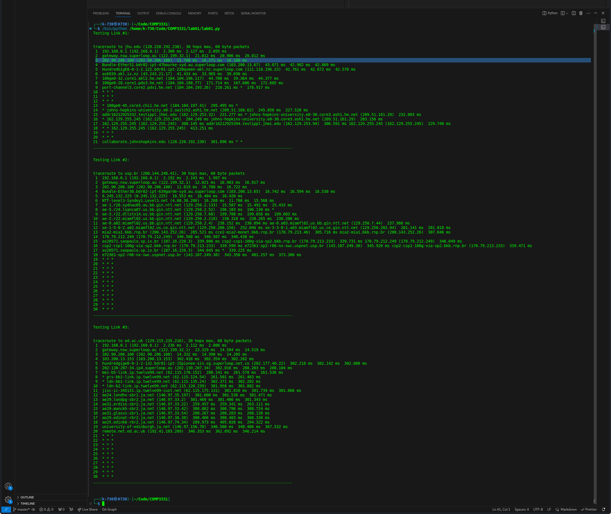

# Lab01

## Q2

**Output for q2**

1. [www.google.co.uk](www.google.co.uk) is reachable
2. [www.columbia.edu](www.columbia.edu) is reachable
3. [www.wikipedia.org](www.wikipedia.org) is reachable
4. [ec.ho](ec.ho) is NOT reachable. This is because the DNS(link) does not not exist. This is confirmed with the browser
5. [hhh.gs](hhh.gs) is reachable.
6. defence.gov.au is reachable. However, the reply packet is absent, yet the link is accessible via browser
7. [yes.no](yes.no) is reachable
8. [one.one.one.one](one.one.one.one) is reachable
9. [theguardian.com](theguardian.com) is reachable
10. [xn--i-7iq.ws](xn--i-7iq.ws) is reachable

## Q3

### a)

#### i)

There are 17 routers along the path to the [usi.ch](usi.ch)

#### ii)

The first international router outside of Australia is Singapore as seen from `geoiplookup` and the website geolocater [ipregistery.co](ipregistery.co)

#### iii)

The first EU router is number 10. Which is ip4.gtt.net (154.14.130.98).

### b)

#### i)

The last routers the destinations have in common is #3 with IP address: 202.90.206.100

Further information about this router reveals my Internet Service Provider with SuperLoop. It is apparently located in Brisbane

#### ii)
