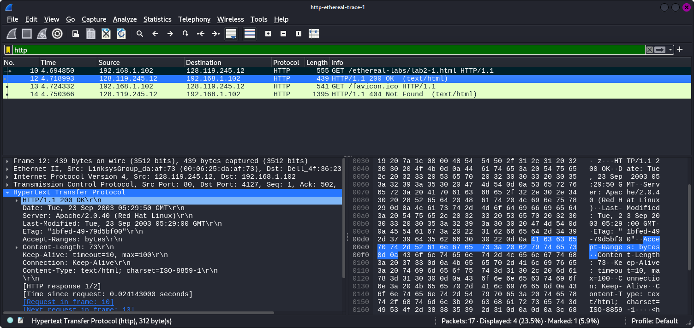
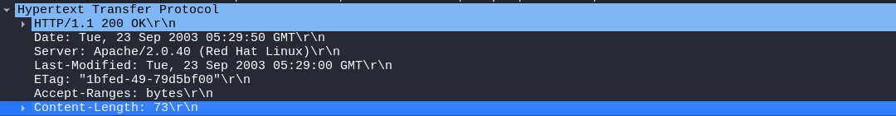
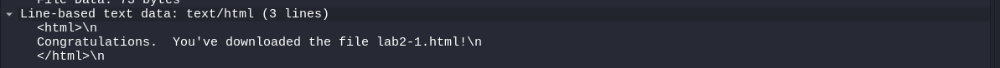
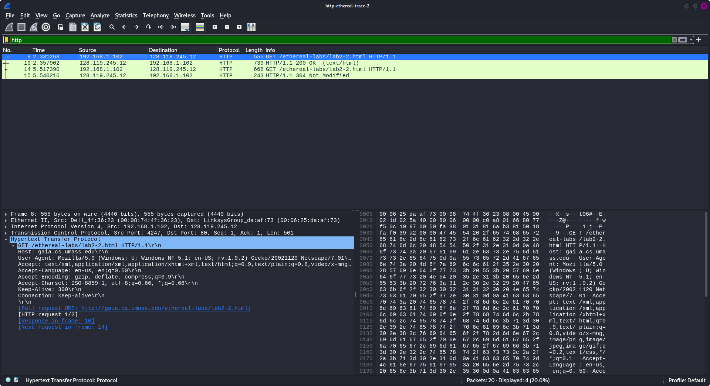
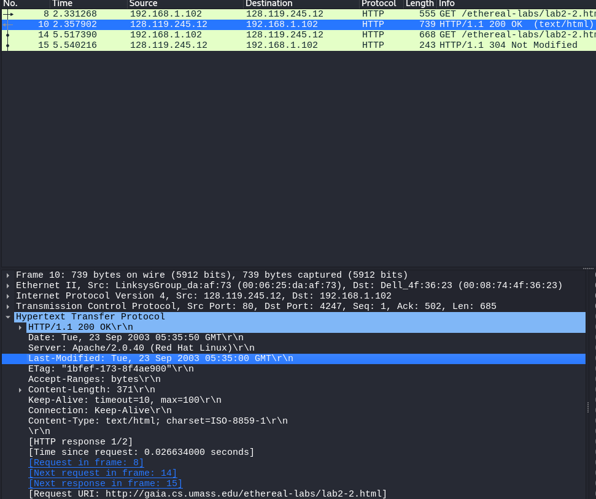
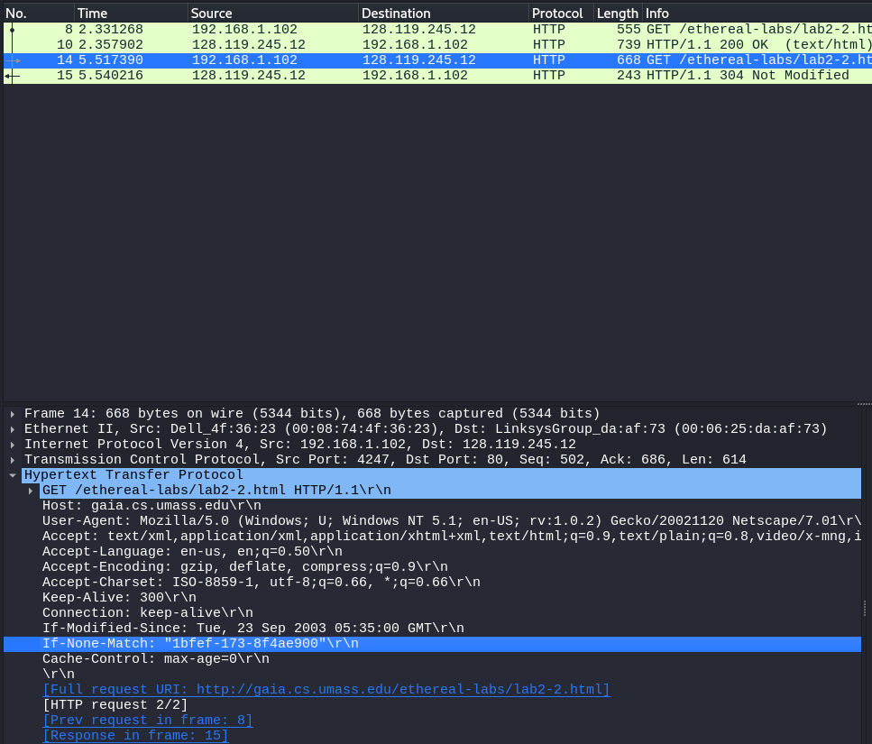
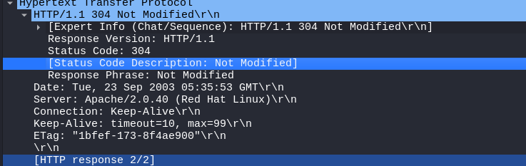
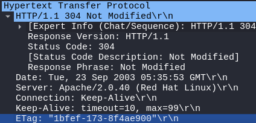
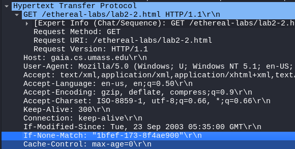

# Lab02

## Exercise 3

### 3.1)

The server returns a 200 status code to the client.

### 3.2) When was the HTML file the browser retrieves last modified at the server? Does the response also contain a DATE header? How are these two fields different?

The HTML file was last modified on Tue, 23 Sep 2003 05:29:00 GMT.

The response also contains a date header.

The _'date'_ header represents the time when the message was sent. This is contrasted by _'last modified'_ which tells the user when the file lab2-1.html was last changed at the server.

### 3.3) Is the connection established between the browser and the server persistent or non-persistent? How can you infer this?

The connection between the browser and server is persistent. We can conclude this because the _'Connection'_ header is _'Keep Alive'_ and represents the persistency of a connection. Additionally, the HTTP version used is `HTTP/1.1` and this version assumes all connections are persistent unless specified.

### 3.4) How many bytes of content are being returned to the browser?

73 bytes of html content is returned:

### 3.5) What is the data contained inside the HTTP response packet?

The data inside the HTTP packet is a HTML file.

## Exercise 4

### 4.1) Inspect the contents of the first HTTP GET request from the browser to the server. Do you see an “IF-MODIFIED-SINCE” line in the HTTP GET?

The first `HTTP GET` request from the browser to server does NOT have “IF-MODIFIED-SINCE” field.

### 4.2) Does the HTTP response from the server indicate the last time the requested file was modified?

Yes, the server shows the last time the file was modified at: Tue, 23 Sep 2003 05:35:00 GMT\r\n

### 4.3)  Now inspect the contents of the second HTTP GET request from the browser to the server. Do you see the “IF-MODIFIED-SINCE:” and “IF-NONE-MATCH” lines in the HTTP GET? If so, what information is contained in these header lines?

Yes, the “IF-MODIFIED-SINCE:” and “IF-NONE-MATCH” headers are present.

“IF-MODIFIED-SINCE:” makes this request conditional if it has been modified after the date _'Tue, 23 Sep 2003 05:35:00'_

“IF-NONE-MATCH” contains the E-tag value. Tt makes this request conditional if it doesn't have an E-tag header.  The E-tag value is: "1bfef-173-8f4ae900"

### 4.4) Question 4: What is the HTTP status code and phrase returned from the server in response to this second HTTP GET? Did the server explicitly return the file's contents? Explain

The response HTTP code is 304 and says _'Not Modfied'_. This means the file (lab2-2.html with E-tag "1bfef-173-8f4ae900" on the client) will not be resent (not explicitly return) from the server because it has not been changed from since the browser's GET request in the header “IF-MODIFIED-SINCE: Tue, 23 Sep 2003 05:35:00”.

### 4.5) What is the value of the Etag field in the 2nd response message, and how is it used? Is the Etag value the same as in the 1 st response?

The E-tags are the same in the 1st and 2nd response.

The E-tag in the 2nd response is: "1bfef-173-8f4ae900"

The E-tag in the 1st response is: "1bfef-173-8f4ae900"

