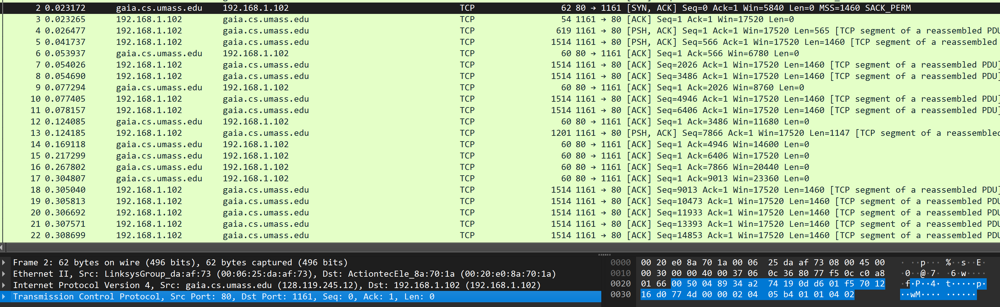
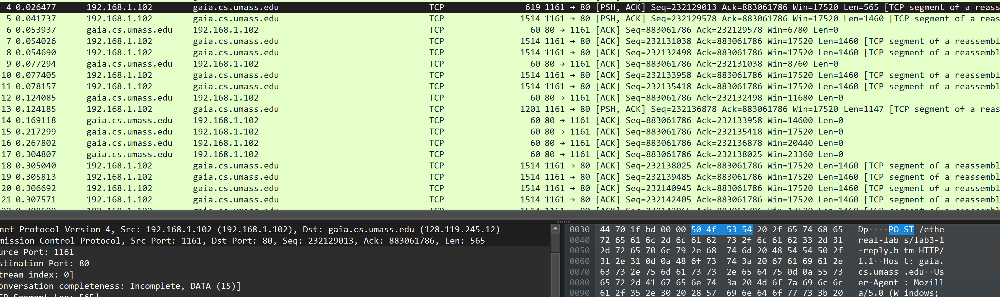
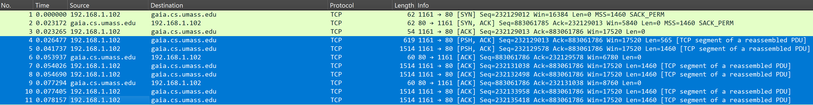
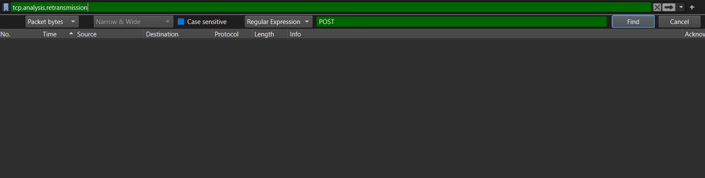
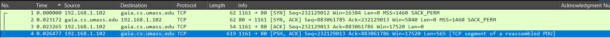
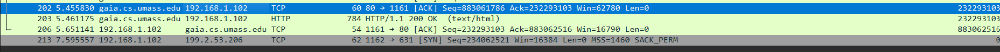

# Lab04

## Exercise 1

### 1.1) What is the IP address of gaia.cs.umass.edu? On what port number is it sending and receiving TCP segments for this connection? What are the IP address and TCP port numbers used by the client computer (source) that is transferring the file to gaia.cs.umass.edu?

For gaia.cs.umass.edu:

- The IP address is: 128.119.245.12
- It sends and receives TCP segments on port 80

For the client it has:

- IP Address: 192.168.1.102
- port: 1161

### 1.2) What is the sequence number of the TCP segment containing the HTTP POST command?

The sequence number containing the HTTP POST command is: **232129013**

### 1.3) Consider the TCP segment containing the HTTP POST as the first segment in the TCP connection

#### 1.3.a) What are the sequence numbers of the first six segments in the TCP connection (including the segment containing the HTTP POST) <u> sent from the client to the webserver </u> (Do not consider the ACKs received from the server as part of these six segments)?

| Packet | TCP Packet No (Sender to Client) | Sequence Number |
| ------ | -------------------------------- | --------------- |
| 1      | 4                                | 232129013       |
| 2      | 5                                | 232129578       |
| 3      | 7                                | 232131038       |
| 4      | 8                                | 232132498       |
| 5      | 10                               | 232133958       |
| 6      | 11                               | 232135418       |

#### 1.3.b) At what time was each segment sent? When was the ACK for each segment received? Given the difference between when each TCP segment was sent and when its acknowledgement was received, what is the RTT value for each of the six segments?

| Packet | TCP Packet No (Sender to Client) | Sequence Number | Time Sent (s) | Acked Time (s) | RTT Value(s) |
| ------ | -------------------------------- | --------------- | ------------- | -------------- | --------- |
| 1      | 4                                | 232129013       | 0.026477      | 0.053937       | 0.02746   |
| 2      | 5                                | 232129578       | 0.041737      | 0.077294       | 0.035557  |
| 3      | 7                                | 232131038       | 0.054026      | 0.124085       | 0.070059  |
| 4      | 8                                | 232132498       | 0.05469       | 0.169118       | 0.114428  |
| 5      | 10                               | 232133958       | 0.077405      | 0.217299       | 0.139894  |
| 6      | 11                               | 232135418       | 0.078157      | 0.267802       | 0.189645  |

#### 1.3.c) What is the EstimatedRTT value (see relevant parts of Section 3.5 or lecture slides) after receiving each ACK? Assume that the initial value of EstimatedRTT is equal to the measured RTT ( SampleRTT ) for the first segment and then is computed using the EstimatedRTT equation for all subsequent segments. Set alpha to 0.125

| Packet | TCP Packet No (Sender to Client) | Sequence Number | Time Sent (s) | Acked Time (s) | RTT Value(s) | Estimated RTT(s) |
| ------ | -------------------------------- | --------------- | ------------- | -------------- | ------------ | ---------------- |
| 1      | 4                                | 232129013       | 0.026477      | 0.053937       | 0.02746      | 0.02746          |
| 2      | 5                                | 232129578       | 0.041737      | 0.077294       | 0.035557     | 0.0284721        |
| 3      | 7                                | 232131038       | 0.054026      | 0.124085       | 0.070059     | 0.0336705        |
| 4      | 8                                | 232132498       | 0.05469       | 0.169118       | 0.114428     | 0.0437652        |
| 5      | 10                               | 232133958       | 0.077405      | 0.217299       | 0.139894     | 0.0557813        |
| 6      | 11                               | 232135418       | 0.078157      | 0.267802       | 0.189645     | 0.0725142        |

(d) What is the length of each of the first six TCP segments?

| Packet | TCP Packet No (Sender to Client) | Packet Length |
| ------ | -------------------------------- | ------------- |
| 1      | 4                                | 565           |
| 2      | 5                                | 1460          |
| 3      | 7                                | 1460          |
| 4      | 8                                | 1460          |
| 5      | 10                               | 1460          |
| 6      | 11                               | 1460          |

### 1.4) What is the minimum amount of available buffer space advertised at the receiver for the entire trace? Does the lack of receiver buffer space ever throttle the sender?

Minimum buffer space advertised in the entire trace is: 5840

The receiver buffer space does not bottleneck (throttle) the sender because the window size does not decrease. It increases from 5840 and stays at 62780.

### 1.5) Are there any retransmitted segments in the trace file? To answer this question, what did you check for (in the trace)?

There are no retransmitted segments in the trace file as seen by the tcp.analysis.retransmission filter.

### 1.6) How much data does the receiver typically acknowledge in an ACK? Can you identify cases where the receiver is ACKing every other received segment (recall the discussion about delayed acks from the lecture notes or Section 3.5 of the text)?

The receiver typically acknowledges **1460** bytes of data in an ack.

The receiver starts to use delayed cumulative ack and seems to begin from packet No. 61 (**3920** bytes of data) onwards and there are many other cases of the receiver doing this.

Between No. 87-89 we can see the receiver (gaia.cs.umass.edu) using a cumulative ack to acknowledge the 2 packets in between 81-86 because from the calculation below:

Packet No. 87 has seqnum $$232190097$$ and Packet No. 88 has seqno: $$232193017$$

The difference between them: $$(232193017 - 232190097) = 2920 = 2*1460$$ bytes of data acked

Which means the receiver is using a cumulative ack to acknowledge packet No. 81 and 82. And the other following packets

The receiver is doing this because it waits up to 500ms for the next segment. If it arrives it sends a cumulative ack. Otherwise, it just sends the ack of that newly receive message. This is known as a delayed ack

### 1.7) What is the TCP connection's throughput (bytes transferred per unit of time during the connection)? Explain how you calculated this value

Network Throughput is defined as:

$$ Throughput = { FileSize \over TimeTakenFileTransfer} $$

To get the actual time taken to transfer the file, we need to exclude the TCP setup and teardown phase times(syn and fin).

We start at packet No. 4.  So start time = 0.02647

We end at packet No.202 because we need to ack the last data packet. So the end time = 5.455830

So the total time taken to transfer the file is:
$$5.455830s - 0.02647s = 5.42936s $$

The FileSize can be found by taking the difference between Packet No. 202's acknowledgement number and Packet No 4 's sequence number
$$ 232293103 - 232129013 = 164,090 \text{ bytes} $$

Therefore the Throughput is:
$${164,090 \over 5.42936} = 30,222.715 \text{ bytes / sec} = 30.222 \text{ KB / s}$$

## Exercise 2

### 2.1) What is the sequence number of the TCP SYN segment that is used to initiate the TCP connection between the client computer and server?

The sequence number of the TCP SYN Segment that starts the TCP connection is: **2818463618**

### 2.2) What is the sequence number of the SYNACK segment sent by the server to the client computer in reply to the SYN? What is the value of the Acknowledgement field in the SYNACK segment? How did the server determine that value?

The replied sequence number of the TCP SYNACK segment is: **1247095790**

The value of the Acknowledgement field in the SYNACK Segment is: **2818463619**

The server determined this value by incrementing the client's seequence number by one: $2818463618 + 1 = 2818463619$

### 2.3) What is the sequence number of the ACK segment sent by the client computer in response to the SYNACK? What is the value of the Acknowledgment field in this ACK segment? Does this segment contain any data?

Sequence number of the ACK segment sent by the client: $2818463619$

Acknowledgment number in the ACK segment is: $1247095791$

The segment does not contain any data as the sequence number in packet No. 298 is the same in packet No.297

### 2.4) Who has done the active close? Is it the client or the server? How you have determined this? What type of closure has been performed? 3 Segment (FIN/FINACK/ACK), 4 Segment (FIN/ACK/FIN/ACK) or Simultaneous close?

A simultaneous close has been conducted.

Both the client and server has initiated the active close by sending the (FIN,ACK) segment. This is becuase both the client and server sent a (FIN,ACK) segment without receiving a (FIN) segment first.

More so the sequence number in Packet No.304 is the same for the acknowledgement number in Packet No.305 instead of (seqnum(No304) + 1).

Lastly, the both increment the sequence numbers by 1 and acknowledge the FIN segment to indicate a closed connection.

Therefore a Simultaneous has been performed.

### 2.5)  How many data bytes have been transferred from the client to the server and from the server to the client during the whole duration of the connection? What relationship does this have with the Initial Sequence Number and the final ACK received from the other side?

Client:

$$ (1) \text{Client inital sequence number after setup (Exclude SYN)} = 2818463619$$

$$(2) \text{Client final sequence number after sending data (Exlcude FIN)} = 2818463652$$

$$ \text{Bytes Sent By Client} = (2) - (1) = 2818463652 - 2818463619 = 33 \text{ bytes} $$
Server:

$$ (1) \text{Server inital sequence number after setup (Exclude SYN)} = 1247095791 $$

$$(2) \text{Server final sequence number after sending data (Exlcude FIN)} = 1247095831$$

$$ \text{Bytes Sent By Server} = (2) - (1) = 1247095831 - 1247095791 = 40 \text{ bytes} $$

Initially, during the connection setup the relationship is that each side has it's own sequence number and we increment the sequence number by one and assign it to the acknowledgement number in the SynAck.

Then the relationship is that we increment the sequence number with the length of the TCP data sent. This will be put in the acknowledgement number in the response packet and repeats until we reach the connection tear down phase.

During the teardown phase, we also increment the sequence number by one when sending a response to the FIN segment.

At sender:
$$\text{Initial SeqNum} = \text{ackNumber of received packet}$$
At receiver:
$$\text{ackNumber} = \text{SeqNum of received packet} + \text{lengthTCPSegment}$$

And if a SYN or FIN segment is received, then increment the sequence number by 1 and assign it as the acknowledgement number
