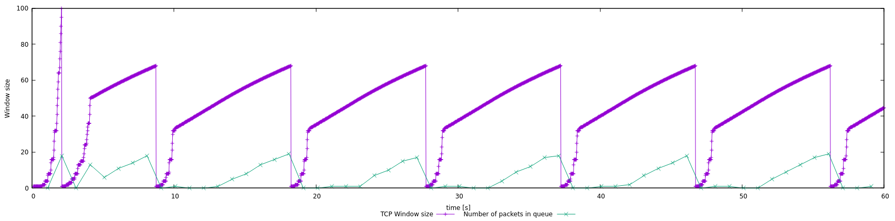

# Lab05

## Exercise 1

### 1.1a) In this case, what is the maximum size of the congestion window that the TCP flow reaches?

The maximum congestion window size that is reached is 100 at 2.08secs.

### 1.1b) What does the TCP flow do when the congestion window reaches this value? Why?

~~The TCP flow will continue to use _slow-start_ as it has not reached the slow start threshold (ssthresh)~~

The congestion window (cwind) will fall to 1, and the slow start threshold (ssthresh) will be half of 100 (This is from the congestion window and so ssthresh is 50) according to TCP tahoe.

This will occur because the sender has encountered a timeout or a triple ACK, which indicates that the receiver has a full queue because of the sender's increased window size

### 1.1c) What happens next?

The sender will be in the _slow-start_ stage to increase window size up to ssthresh. Since ssthresh is now 50, after cwind reaches ssthresh, it will begin to use _additive increase_ algorithm the increase the cwind size by 1 until it receives a timeout or triple-ack (because of a full queue from the receiver). Then cwind will drop back to 1 and the cycle continues

## Exercise 2
