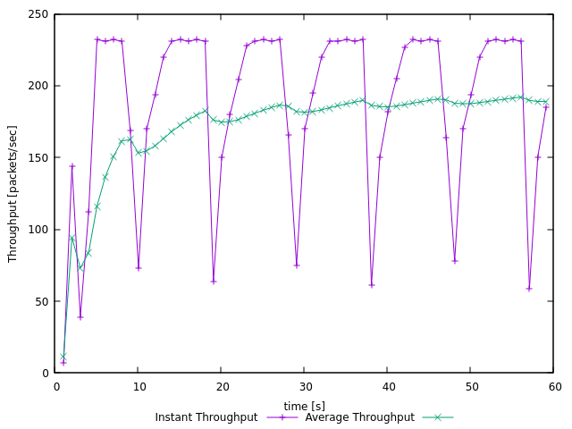
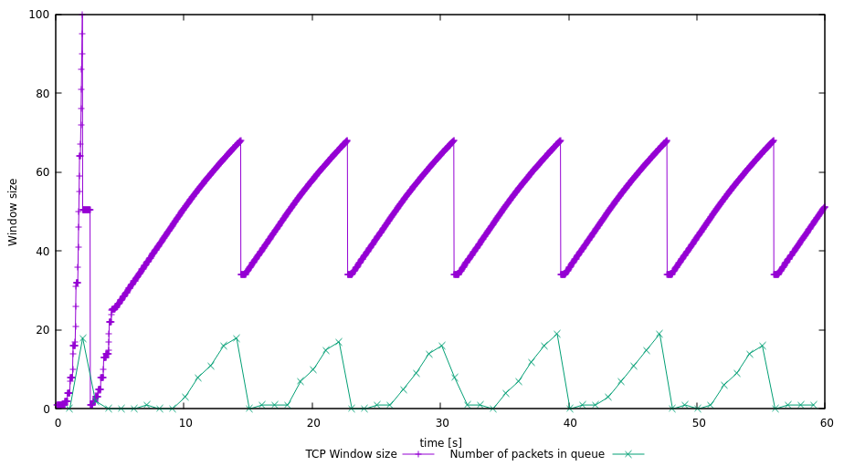
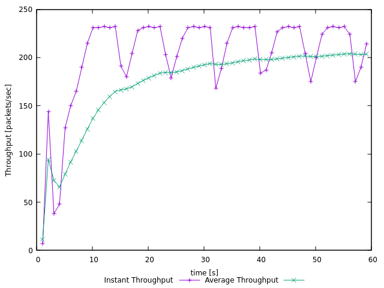
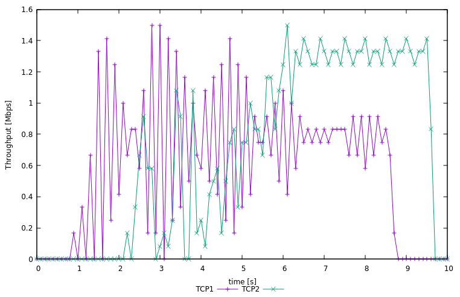
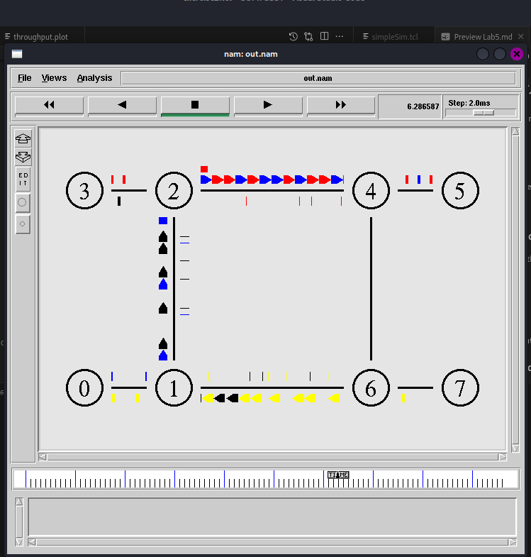
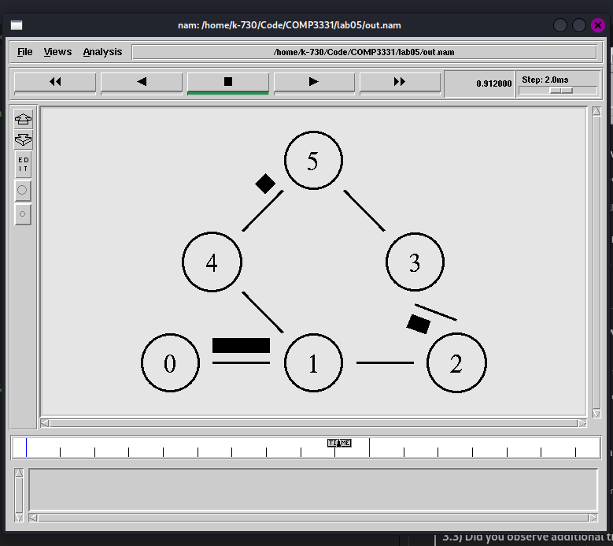
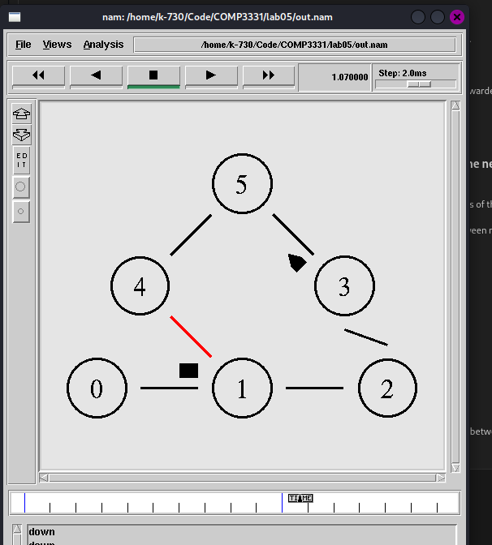
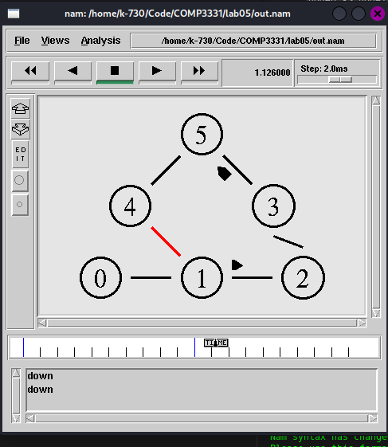
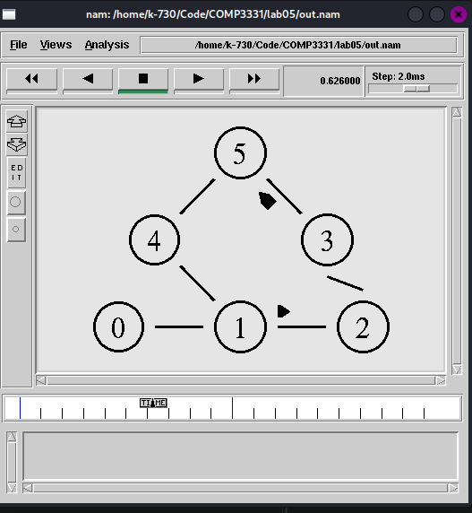
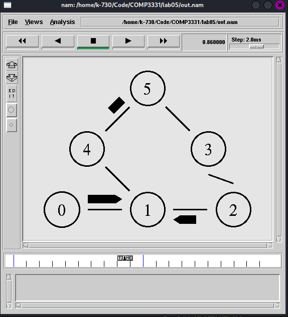

# Lab05

## Exercise 1

### 1.1a) In this case, what is the maximum size of the congestion window that the TCP flow reaches?

The maximum congestion window size that is reached is 100 at 2.08secs.

### 1.1b) What does the TCP flow do when the congestion window reaches this value? Why?

The congestion window (cwind) will fall to 1, and the slow start threshold (ssthresh) will be half of 100 (This is from the congestion window and so ssthresh is 50) according to TCP tahoe.

This will occur because the sender has encountered a timeout or a triple ACK, which indicates that the receiver has a full queue because of the sender's increased window size

### 1.1c) What happens next?

The sender will be in the _slow-start_ stage to increase window size up to ssthresh. Since ssthresh is now 50, after cwind reaches ssthresh, it will begin to use _additive increase_ algorithm the increase the cwind size by 1 until it receives a timeout or triple-ack (because of a full queue from the receiver). Then cwind will drop back to 1 and the cycle continues

### 1.2)From the simulation script we used, we know that the packet's payload is 500 Bytes. Keep in mind that the size of the IP and TCP headers is 20 Bytes each. Neglect any other headers. What is the average throughput of TCP in this case? (both in number of packets per second and bps)

As seen in the graph above, the average throughput for TCP stabilises around 193 packets/second after 35s.
The total packet size including headers is: (500 + 20 + 20) = 540 bytes

and so the bytes / second is: 540 *193 = 104,220 bytes / second

Thus the bits / second is = 8* 104,220 bytes / s = 833,760 bits/s = 833.76kbps

### 1.3)Question 3: Repeat the steps outlined in Questions 1 and 2 (NOT Question 3) but for TCP Reno. Compare the graphs for the two implementations and explain the differences. (Hint: compare the number of times the congestion window returns to zero in each case). How does the average throughput differ in both implementations?

**TCP Renoe window size** | **TCP Renoe Throughput**
:-------------------------:|:-------------------------:
 |  

**TCP Tahoe window size** | **TCP Tahoe Throughput**
:-------------------------:|:-------------------------:
 |  

The differences in graphs for the window size is because on a fast retrasnsmit, TCP Renoe will set the cwind to be cwind / 2 and the ssthresh will be set to cwind / 2. Whereas TCP Tahoe sets the cwind to be 1 after a fast retransmit or a timeout.

Additionally for TCP Renoe in the beginning, there is a Triple Duplicate Ack and results in a brief constant window size of approx. 50. Then the cwind drops to 1 after encountering a timeout. Unlike TCP Tahoe, which drops the cwind to 1

TCP Renoe average throughput is around 200 packets/sec = 200 _(540)_ 8 = 864,000 bits/s = 864 kbps.

Where as TCP Tahoe has an average throughput of approx. 833.76kbps

This is because the window size for TCP Renoe drop drastically to 1, and thus the number of packets sent per second (Throughput) will appear more smoother than TCP Tahoe.

## Exercise 2

### 2.1) Why is the throughput achieved by flow tcp2 higher than tcp1 between 6 sec to 8 sec?

The reason is because tcp1 and tcp2 compete over bandwith the link and that tcp1 has a higher RTT (200ms) than tcp2(120ms).
Specifically, tcp1 and tcp2 will compete over bandwith on link n2-n4.
and tcp1 will also compete with tcp4 for link bandiwth over n1-n2.
Since tcp2 has a lower RTT than tcp1, this means tcp2 will eventually have a greater flow than tcp1

### 2.2) Why does the throughput for flow tcp1 fluctuate between a time span of 0.5 sec to 2 sec?

The throughput fluctuates because tcp1 is in the slow start stage.

## Exercise 3

### 3.1) Which nodes communicate with which other nodes? Which route do the packets follow? Does it change over time?

node0 sends packets to node5 and node2 sends packets to node5

The packets follow respectively from:
node0 -> node1 -> node4 -> node5
node2 -> node3 -> node5

It does not change over time

### 3.2) What happens at time 1.0 and time 1.2? Does the route between the communicating nodes change as a result?

Between time 1.0 to 1.2, the link between node1 to node4 is down.

The packet following route node0 to node5 cannot reach node 5 and the packet terminates at node1.

The route between node0 to node5 does not change as it is using a static routing protocol.

### 3.3) Did you observe additional traffic compared to Step 3 above? How does the network react to the changes that take place at time 1.0 and time 1.2 now?

Additional traffic was observed by the Distance Vector Algorithm, as it sends packets to other routers of the low cost routes.

Between time 1.0 to 1.2, the link between node1 to node4 is down. But now the communication between node0 to node5 follows the route:

`n0 -> n1 -> n2 -> n3 -> n5`

Packets now follow the above route.

After 1.2 seconds, link between node1 to node4 is online and communication between node0 to node5 follows the route:

`node0 -> node1 -> node4 -> node5`

This is because this route has a lower cost lower than the previous route.

### 3.4) How does this change affect the routing? Explain why

Making the cost of the link higher (3) in the link between node1 -> node4 causes the communication between node0 to node5 to follow the route:
n0 -> n1 -> n2 -> n3 -> n5

This is because the cost to follow route:

`n0 -> n1 -> n2 -> n3 -> n5`

has a cost of 4

This is actually lower than the cost of the route:

`node0 -> node1 -> node4 -> node5`

as it has a cost of 5.

### 3.5) Describe what happens and deduce the effect of the line you just uncommented

THe communication between node2 to node5 can take either routes:

(a) n2 -> n1 -> n4 -> n5
(b) n2 -> n3 -> n5

This occurs because the cost between the routes a and route b are actually the same. (They both have a total cost of 4). By uncommenting `Node set multiPath_ 1` this actually makes the packet take either route (a) or route(b). Thus the traffic will be split equally to both route(a) and route(b)
